# C++ Primer Plus

Personal notes / Summary

<head>
    <link rel="canonical" href="https://deimosmh.github.io/DCH_CppPrimerPlus/" />
</head>

<script>
window.onload = function() {
    function createTOC() {
        var headings = document.querySelectorAll('h2');
        var toc = document.createElement('ul');
        toc.classList.add('toc_custom_sec'); // Add the class here
        headings.forEach(function(heading, index) {
            var li = document.createElement('li');
            var a = document.createElement('a');
            a.href = '#' + heading.id;
            a.textContent = heading.textContent;
            li.appendChild(a);
            toc.appendChild(li);
        });
        return toc;
    }

    function insertTOC() {
        var main = document.querySelector('.md-main');
        var toc = createTOC();
        main.insertBefore(toc, main.firstChild);
    }

    insertTOC();
}
</script>

<style>
.md-main .toc_custom_sec {
    position: fixed;
    top: 100px;
    left: 10px;
    background-color: transparent;
    padding: 15px;
}

@media screen and (max-aspect-ratio: 16/9) {
  .md-main .toc_custom_sec {
    display: none;
  }
}
</style>

## Chapter 1: Getting Started

Computer language deal with 2 concepts: DATA (information) & ALGORITHMS (methods)

C++ joins three programming categories:

- *C*   - Procedural language
- *C++* - Object-oriented language, represented by: class enhancements
- *C++* - Generic programming (eg. write function for a generic (unspecified) type
once and use it for variety of actual types)

**Object-Oriented Programming (OOP):**

- *Class* - Defines what data is used to represent object and what operations
can be performed on it; data form; [name, date, ...]
- *Object* - data structure; [David, 19.01.2000, ...]

Bottom-up programming - going from lower level (eg. classes) to higher
(eg. program design) OOP facilitates creating reusable code with:

- *Information hiding* - safeguard from improper access
- *Polymorphism* - allows creating multiple definitions for operators and functions
- *Inheritance* - allows deriving new classes from old ones

**Mechanics of creating a Program:**

1. Write and save program: source code ``code.cpp``
2. Compile the source code: translation to machine language ``gcc ./code.cpp``
3. Link with additional code: libraries, functions; The output is executable code

**Common phrases:**

- *Compile* - Compile code in the file you are currently in
- *Build/Make* - Compile code for all source code files in the project
- *Build All* - Compile all source code files from scratch
- *Link* - Combine compiled source code with necessary library code
- *Run/Execute* - Run the program ./prog or exe
- *Debug* - Run program with option of going  through step-by-step

## Chapter 2: Setting Out to C++

<details><summary>
List of what you will learn
</summary>

```cpp
    1. Creation and format of C++ program </br>
    2. The #include directive </br>
    3. The main() function </br>
    4. Using cout object for output </br>
    5. Using cin object for input</br>
    6. How/when use endl</br>
    7. Placing comments in C++ program </br>
    8. Declaring and using variables and functions</br>
```

</details> <br>

***C++ is:***

- `case sensitive` - it distinguish uppercase from lowercase characters
- `spelling sensitive` - kout or coot instead of `cout` will give you error

***Construction of C++ program:***
C++ program is constructed from functions "C++ building blocks".
Typical program is organized to major tasks with separated functions to handle
those tasks. Below is simple function named `main()`:

```cpp
// myfirst.cpp -- displays a message
#include <iostream>                          // a PREPROCESSOR directive
int main()                                   // function header
{                                            // start of function body
    using namespace std;                     // make definitions visible
    cout << "Come up and C++ me some time."; // message
    cout << endl;                            // start a new line
    cout << "You won’t regret it!" << endl;  // more output
    return 0;                                // terminate main()
} // end of function body
```

The fundamental structure of program (listing) above is:

```cpp
int main()
{
    statements
    return 0;
}
```

It have two parts: function header `int main()` and function body enclosed in brackets.

C++ uses `preprocerssor` - Program, that process a source file before the main
compilation takes place; directives whose names begins with `#`. Program above
uses `#include` directive (thus they are named include files - they are included
in other files/included at the beggining) of `iostream` file that is responsible
with communication with external world (input/output).

- `using namespace std` - use all namespace directives from std library `std::`
- `using std::cout` - use only one `std::` qualifier
- `cout` - predefined object that knows how to display variety of things
- ***Operator Overloading*** - the same operator with different meanings,
eg.: "`<<`" is insertion operator and bitwise left-shift operator.
The meaning is defined by context.
- `endl` - Moves screen coursor to the new line; equvalent to newline
character "`\n`" from C, but `endl` guarantees that output will be `flushed`.
Special notations (to `cout`) like this are called `manipulators`
- ***tokens*** - indivisible elements in a line of code, eg.: `int`

---

***Statements***

To store information on a computer you need:

- identify storage location
- identify how much storage information requires
- ***C++ program*** - collection of functions.
- ***Function*** - collection of statements.
- `=` - assignment operator from right to left (assign value to a storage location).
- `<<` - insertion operator - defined in *ostream* class
- ``>>`` - extraction operator - defined in *istream* class

```cpp
/* 
- declaration statement 
- definition - variable is declared and it causes compiler to allocate memory space
 for variable. Declaration don't need to be the definition (something is declared
 but it don't need to have allocated space)
 */
int x;  

x = 10; // - assignement statement - provide/assign value to variable/storage location
x = x - 1 // - arithmetic expression 
```

---

*class* - data type that user defines
*to define class* - describe what **information** it can represent and what **action**
 you can perform on data or in other words

```cpp
x = sqrt(6.25)        -->    function call                 -->    |code for sqrt|
                                                                        ▼
|assign return to x|  <--    return to calling function    <--    | sqrt return |
```

Argument `6.25` is ***passed*** to a function sqrt

***function prototype*** - is for function as variable declaration for variables
decribe the function interface and needs to be before function definition;
 if you use it you will need to provide prototype in source code or with #include

??? example "function prototype"
    <!--codeinclude-->
    [](../programs/function_prototype.cpp)
    <!--/codeinclude-->

***function definition*** - code for function workings

***keyword*** - vocabulary of a computer language: *int, void, return, double,
etc..* - the list of them is in appendix "C++ Reserved Words"; functions and
object names are not keywords

```cpp
//function prototype; initial double is type of returned value from sqrt; 
//double in sqrt(double) is passed argument for sqrt 
double sqrt(double);  
```

***exit values*** - (tested) return values of executed program. default convention:
0 - program ran successfully; >0 - error/problem

- Declaration statement — A declaration statement announces the name and the
  type of a variable used in a function.
- Assignment statement — An assignment statement uses the assignment operator (=)
  to assign a value to a variable.
- Message statement — A message statement sends a message to an object, initiating
  some sort of action.
- Function call — A function call activates a function.When the called function ter-
  minates, the program returns to the statement in the calling function immediately
  following the function call.
- Function prototype — A function prototype declares the return type for a function,
  along with the number and type of arguments the function expects.
- Return statement — A return statement sends a value from a called function back
  to the calling function.

---

## Chapter 3: Dealing with Data

<details><summary>
List of what you will learn
</summary>

```sh
- Rules for naming C++ variables
- C++’s built-in integer types: unsigned long, long, unsigned int, int, unsigned
short, short, char, unsigned char, signed char, bool
- C++11’s additions: unsigned long long and long long
- The climits file, which represents system limits for various integer types
- Numeric literals (constants) of various integer types
- Using the const qualifier to create symbolic constants
- C++’s built-in floating-point types: float, double, and long double
- The cfloat file, which represents system limits for various floating-point types
- Numeric literals of various floating-point types
- C++’s arithmetic operators
- Automatic type conversions
- Forced type conversions (type casts)
```

</details><br>

**Build-in C++ data types**:

- fundamental types - integers and floating point numbers
- compound types - arrays, strings, pointers and structures, explained in Chapter 4

**To store item of information on a computer you need to track**:

- Where the information is stored
- What value is kept there
- What kind of information is stored

**C++ naming rules**:

- Only characters you can use in names are: alphabetic characters,
numeric digits and underscore character
- The first character in a name cannot be a nu,eric digit
- Uppercase characters are considered distinct from lowercase characters
- You can't use C++ keyword for a name
- Names beginning with two underscore characters or with an underscore character
followed by an uppercase letter are reseved for use by implementatio
(the compiler and the resources it uses).
- Names beggining with single underscore character are reserved for use a
global identifiers bt the implementation
- C++ places no limits on the length of a name, and all characters in a name are
significant (but some platforms can have their own length limits).

Data

- *width* - term for the amount of memory used to hold variable
- *operator* - build in language element that operates on one or more items to
produce a value (addition operator `+` adds two values)
  - *sizeof* - return size in bytes of a tupe or variable
  - *climits* - header file - contain information about integer type limits,

??? example "limits.cpp"
    <!--codeinclude-->
    [](../programs/limits.cpp)
    <!--/codeinclude-->

### Initialization

Combines assignment with declaration, for example:

```cpp
int i_sth = INT_MAX; 
int owls = 101; // traditional C initialization, sets owls to 101
int wrens(432); // alternative C++ syntax, set wrens to 432
```

Not initialized variables are **indeterminate** - value is what was previously
in memory, assigned to the newly declared variable;

**C++11 initialization:**

- using a braced initializer `{}`
- braces can be left empty, in which case the variable is initialized to 0
- it can be used with or without the = sign
- it provides better protection against type conversion errors
(more on end of this chapter)
  
```cpp
int emus{7};        // set emus to 5
int rheas = {12};   // set rheas to 12
int rocs = {};      // set rocs to 0
int psychics{};     // set psychics to
```

---

Exceeding max value (range of data type) will make value assign the lowest value
possible (like odometer).  

Amount of allocated memory for `int` (and thus max range/value) can differ from
devices and compilers, but is *natural* (computer handles it most efficiently);
`long` type is more reliable (32bit), but worse in other aspects.

### Literals

Constant values that are assigned to the constant variables.

#### Integer literals

- *042* - octal value - base 8
- *42* - decimal value, base 10  
- *0x42* - hexadecimal value - base 16

Example in hexoctl.cpp

??? example "hexoct1.cpp"
    <!--codeinclude-->
    [](../programs/hexoct1.cpp)
    <!--/codeinclude-->

You can `cout` manipulators `dec`, `oct`, `hex` for changing numer base.
Example in hexoct2.cpp

??? example "hexoct2.cpp"
    <!--codeinclude-->
    [](../programs/hexoct2.cpp)
    <!--/codeinclude-->

#### Character literals

**Suffix** for constant:

`l`, `L` - 32bit long constant
`u`, `U` - unsigned int constant
`ul` (any combination of letters) - unsigned long constant
`ll`, `LL` - C++11 long long constant
`ULL` - C++11 unsigned long long constant

| data    | Stored as  |
|---------|------------|
| `1500`  | 16bit int  |
| `1500L` | 32bit long |

Characters set, like **ASCII** defines which number defines character.
Thus `char` is `int` data type value and operations on it like on ints can be performed.
Printed characters are processed through `cout`.

Using single quotation marks, eg. `'A'` for character display is better, because
it doesn't assume particular code.

Escape codes represent characters, that you cannot input from keyboard notrmally:

??? note "Table of escape codes"
    | Character Name | ASCII Symbol | C++ Code | ASCII Decimal Code  | ASCII Hex Code |
    | -------------- | ------------ | -------- | ------------------- | -------------- |
    | Newline        | NL (LF)      | `\n`     | 10                  | `0xA`          |
    | Horizontal tab | HT           | `\t`     | 9                   | `0x9`          |
    | Vertical tab   | VT           | `\v`     | 11                  | `0xB`          |
    | Backspace      | BS           | `\b`     | 8                   | `0x8`          |
    | Carriage return | CR          | `\r`     | 13                  | `0xD`          |
    | Alert          | BEL          | `\a`     | 7                   | `0x7`          |
    | Backslash      | \            | `\\`     | 92                  | `0x5C`         |
    | Question mark  | ?            | `\\?`    | 63                  | `0x3F`         |
    | Single quote   | ’            | `\\'`    | 39                  | `0x27`         |
    | Double quote   | ”            | `\\"`    | 34                  | `0x22`         |

??? example "Example of use: bondini.cpp"
    <!--codeinclude-->
    [](../programs/bondini.cpp)
    <!--/codeinclude-->

**Universal Character Names** - used for international characters like French vowel.
It starts with `\u` ot `\U`, eg.: ``` cout << "g\u00E2teau. ``` - **ISO 10646**

`wchar_t` - wide character set - for characters that don't fit within 8-bit bute
(eg.: Japanese kanji system). It is 16-bit or larger. `wchar_t` can vary from
one implementation to another.

#### C++11 types

- `char16_t` - unsigned 16-bits, use `u` prefix for `char16_t`, eg.: `u"good"` or `u'R'`
- `char32_t` - unsigned 32-bits, use `U` prefix for `char32_t`

### Member function (OOP)

Eg. `cout.put()`, belongs to a class and describes a method for manipulating
class data. `put()` is a class member function. `.` is **membersip operator**.
You can use member function only with particular object in that class (in this
case `ostream`), such as `cout` class object in this case.

In short: class - `ostream`, class object - `cout`, function name (member function) - `put()`

`cout.put()` is alternative for using `<<` operator to display character.

### *bool* type

C++ interprets nonzero values as *true* and zeros values as *false*
You can use `bool` type to reprsent those values:

```cpp
bool read = true; 
```

The literals true and false can be converted to type int by promotion, with
*true* converting to 1 and *false* to 0 and vice-versa:

```cpp
int ans = true;         // ans assigned 1
int promise = false;    // promise assigned 0
bool is_tru = -500;     // any non-zero will be converted to true 
```

### *const* qualifier

- if attempted to change, compilator will give error
- if value is not provided during declaration, it will be unspecified, that you
cannot modify
- you can use *scoping rules* (chapter 9) to limit it to particular function or
files (advantage over *#define*, second advantage is you can use const with
elaborate types, such as *arrays* or *structures*)

Example of use:
`const int Months = 12;`

### Floating-Point Numbers

There is two ways of writing floating-point numbers:

- standard, decimal-point notation, eg.: `12.34`
- representing floating-point values is called E notation, eg.:
`-3.45E6` *= -3.4* 10^6* (where `6` - exponent, `3.45` - mantissa).

#### Floating-Point Types

All three can be the same size. Typically, float is 32 bits, double is 64 bits,
and long double is 80, 96, or 128 bits, and range in exponents for all three types
is at least *–37 to +37*. You can look in the `cfloat` or `float.h` header files to
find the limits for your system.

The program *floatnum.cpp* display limiitations of floating-point numbers precision
and previews an *ostream* method called `setf()` from Chapter 17. This call forces
output to stay in ***fixed-point notation*** so that you can better see the precision.

??? example "floatnum.cpp"
    <!--codeinclude-->
    [](../programs/floatnum.cpp)
    <!--/codeinclude-->

#### Floating-Point Constants

Use suffixes for declaration
`f` or `F` - float constant, eg.: `1.234f`
`l` or `L` - long double

```cpp
1.234f // a float constant
2.45E20F // a float constant
2.345324E28 // a double constant
2.2L // a long double constant
```

#### Plus and Cons of Floating-Point values

`-` operations usually are *slightly slower* than integer operations
`-` you can *lose precision* and values:

??? example "example: fltadd.cpp"
    <!--codeinclude-->
    [](..\programs\fltadd.cpp)
    <!--/codeinclude-->

`+` represent *values betwewen integers*
`+` can represent a much *greater range of values*, because of the scaling factor

### C++ Arithmetic Operators

- *operators*: `+`, `-`, `*`, `%`, `/`, `*`
- *operands* - two values used for calculation via *operators*
- *expression* - combined operator with operands
  
`%` - modulo works only with integers and produces remainder of dividing first
value by second. `19 % 6` is `1`, because 6 goes into 19 three times, with

??? example "remainder of 1. Practical example: modulus.cpp"
    <!--codeinclude-->
    [modulus.cpp](..\programs\modulus.cpp)
    <!--/codeinclude-->

`precedence rules` - When more than one operator can be applied to the same
operand, C++ uses`precedence rules` to decide which operator is used first.

`int flyingpigs = 3 + 4 * 5; // 35 or 23?`
The arithmetic operators follow the usual algebraic precedence, with multiplication,
division, and the taking of the modulus done before addition and subtraction.

Appendix D,“Operator Precedence,” - The `/` and `*` operators have the same precedence.
`float logs = 120 / 4 * 5; // 150 or 6?`

When two operators have the same precedence, C++ looks at whether the operators
have a `left-to-right associativity` or a `right-to-left associativity`.

Appendix D shows that multiplication and division associate left-to-right.

### Conversion

- truncation - discarding fractional part in `int`, when converting from
floating-point to int value (eg.: `int g(1.123)`)

C++11 - doesn't permit *narrowing* - variable may not be able to represent the
assigned value:

```cpp
const int code = 66;
int x = 66;
char c1 {31325}; // narrowing, not allowed
char c2 = {66}; // allowed because char can hold 66
char c3 {code}; // ditto
char c4 = {x}; // not allowed, x is not constant
x = 31325;
char c5 = x; // allowed by this form of initialization
```

- integral promotion - automatic conversion evaluates expressions, C++
converts `bool`, `char`, `unsigned char`, `signed char`, and `short` values to `int`, eg.:

```cpp
short chickens = 20; // line 1
short ducks = 35; // line 2
short fowl = chickens + ducks; // line 3
```

For `fowl`, `chickens` and `ducks` got converted (promoted) to `int` for
calculation and then result got converted back to `short`. This is because `int`
is the computer most *natural type*

**Type cast conversion**
Is explicit form of conversion

```cpp
(long) thorn // returns a type long conversion of thorn
long (thorn) // returns a type long conversion of thorn
```

The type cast doesn’t alter the thorn variable itself; instead, it creates
new value of the indicated type, which you can then use in an expression, as
in the following:

```cpp
cout << int('Q'); // displays the integer code for 'Q'
```

### Static type cast conversion

In c++ of the four, the static_cast<> operator, can be used for converting values
from one numeric type to another. For example, using it to convert thorn to a
type long value looks like this:

```cpp
static_cast<long> (thorn)
```

??? example "typecast.cpp"
    <!--codeinclude-->
    [](../programs/typecast.cpp)
    <!--/codeinclude-->

**`auto` in C++11**

Just use `auto` instead of the type name in an initializing declaration, and the
compiler assigns the variable the same type as that of the initializer:

```cpp
auto n = 100; // n is int
auto x = 1.5; // x is double
auto y = 1.3e12L; // y is long double
```

Automatic type deduction becomes much more useful when dealing with complicated
types, such as those in the **STL (Standard Template Library)**. For example:

C++98 code:

```cpp
std::vector<double> scores;
std::vector<double>::iterator pv = scores.begin();
```

C++11 code:

```cpp
std::vector<double> scores;
auto pv = scores.begin();
```

## Chapter 4: Compound Types

<details><summary>
        List of what you will learn
</summary>

```cpp
Creating and using arrays
Creating and using C-style strings
Creating and using string-class strings
Using the getline() and get() methods for reading strings
Mixing string and numeric input
Creating and using structures
Creating and using unions
Creating and using enumerations
Creating and using pointers
Managing dynamic memory with new and delete
Creating dynamic arrays
Creating dynamic structures
Automatic, static, and dynamic storage
The vector and array classes (an introduction)
```

</details>

### Arrays

Data form that can hold many values of one type. Declaration should indicate three things:

- The type of value to be stored in each element
- The name of the array
- The number of elements in the array

`typeName arrayName[arraySize];` - *arraySize* cannot be a variable whose value
is set while the program is running. However, later in this chapter you’ll learn
how to use `the` new operator to get around that restriction

```cpp
short months[12]; // creates array of 12 short
```

An array is called a `compound` type because it is built from some other type.
(C uses the term `derived` type, but because C++ uses the term `derived` for
class relationships, it had to come up with a new term.)

You can access array elements individually.The way to do this is to use a
`subscript`, or an `index`, to number the elements. C++ array numbering starts
with zero. **The `index` of the last element is one less than the size of the `array`**

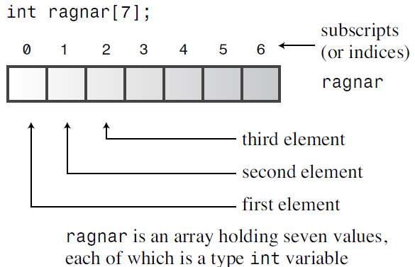

*Declaring* an `array`, *assigning values* to `array` elements,
and *initializing* an `array`:

??? example "arrayone.cpp"
    <!--codeinclude-->
    [](./../programs/arrayone.cpp)
    <!--/codeinclude-->

#### Array Initialization

You can use the initialization form only when defining the array.
You cannot use it later, and you cannot assign one array wholesale to another:

```cpp
int cards[4] = {3, 6, 8, 10};   // okay
int hand[4];                    // okay
hand[4] = {5, 6, 7, 9};         // not allowed
hand = cards;                   // not allowed

// If you partially initialize an array, 
// the compiler sets the remaining elements to zero.
float hotelTips[5] = {5.0, 2.5};

// If you leave the square brackets ([]) empty 
// when you initialize an array, the C++ compiler
// counts the elements for you.
short things[] = {1, 5, 3, 8};
```

Often, letting the compiler count the number of elements is poor practice because
its count can be different from what you think it should be. You could, for instance,
accidently omit an initial value from the list. However, this approach can be a
safe one for initializing a character array to a string, as you’ll soon see.
And if your main concern is that the program, not you, knows how large an array
is, you can do something like this:

```cpp
short things[] = {1, 5, 3, 8};
int num_elements = sizeof things / sizeof (short);
```

##### C++11 Array Initialization

```cpp
// 1. You can drop the = sign when initializing an array:
double earnings[4] {1.2e4, 1.6e4, 1.1e4, 1.7e4}; // okay with C++11

// 2. You can use empty braces to set all the elements to 0:
unsigned int counts[10] = {}; // all elements set to 0
float balances[100] {}; // all elements set to 0

// 3. List-initialization protects against narrowing (As in Chapter 3):
long plifs[] = {25, 92, 3.0}; // not allowed
char slifs[4] {'h', 'i', 1122011, '\0'}; // not allowed
char tlifs[4] {'h', 'i', 112, '\0'}; // allowed
```

`vector` - STL alternative for arrays
`array` template class - C++11 alternative for arrays

### Strings

Series of characters stored in consecutive bytes of memory.

#### C-style strings

C-style strings have a special feature:The last character of every string is the null
character, written `\0`.

```cpp
char dog[8] = { 'b', 'e', 'a', 'u', 'x', ' ', 'I', 'I'}; // not a string!
char cat[8] = {'f', 'a', 't', 'e', 's', 's', 'a', '\0'}; // a string!
char bird[11] = "Mr. Cheeps"; // the \0 is understood
char fish[] = "Bubbles"; // let the compiler count
```

<!--  -->

```cpp
char shirt_size = 'S'; // this is fine
char shirt_size = "S"; // illegal type mismatch
```

But `"S"` is not a character constant; it represents the string consisting of
two characters, the `S` and the `\0` characters. Even worse, `"S"` actually
represents the memory address at which the string is stored. So a statement
like the following attempts to assign a memory address to shirt_size.

##### Concatenating String Literals

C++ enables
you to concatenate string literals—that is, to combine two quoted  strings into one.
`\0` character from the first string is replaced by the first character of the
second string. The following output statements are equivalent to each other:

```cpp
cout << "I'd give my right arm to be" " a great violinist.\n";
cout << "I'd give my right arm to be a great violinist.\n";
cout << "I'd give my right ar"
"m to be a great violinist.\n";
```

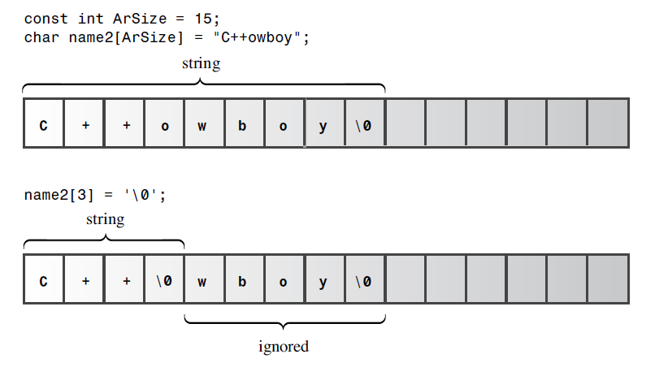

??? example "Strings in an Array: strings.cpp"
    <!--codeinclude-->
    [](../programs/strings.cpp)
    <!--/codeinclude-->

??? example "Problem 1: instr1.cpp, reading string input via cin"
    <!--codeinclude-->
    [](../programs/instr1.cpp)
    <!--/codeinclude-->

??? example "Solution 1: instr2.cpp, Line-Oriented Input with getline()"
    <!--codeinclude-->
    [](../programs/instr2.cpp)
    <!--/codeinclude-->

??? example "Solution 2: instr3.cpp, Line-Oriented Input with get()"
    <!--codeinclude-->
    [](../programs/instr3.cpp)
    <!--/codeinclude-->

??? example "numstr.cpp, Mixing String and Numeric Input"
    <!--codeinclude-->
    [](../programs/numstr.cpp)
    <!--/codeinclude-->

In short:

```cpp
cin.getline(dessert, ArSize);

cin.getline(name1, ArSize).getline(name2, ArSize); // overloading 

cin.get(name, ArSize);
cin.get(dessert, Arsize); // a problem ()

cin.get(name, ArSize); // read first line
cin.get(); // read newline
cin.get(dessert, Arsize); // read second line

cin.get(name, ArSize).get(); // concatenate member functions

// get() (but not getline()) reads an empty
// line, it sets something called the failbit. The implications of 
// this act are that further input is blocked, but you can restore 
// input with the following command:
cin.clear();

// You can also use
cin.get(); // or cin.get(ch);
(cin >> year).get(); // or (cin >> year).get(ch);
```

### `string` Class

To use the string class, a program has to include the string header file.

You should learn from this example that, in many ways, you can use a string
object in the same manner as a character array:

- You can initialize a string object to a C-style string.
- You can use cin to store keyboard input in a string object.
- You can use cout to display a string object.
- You can use array notation to access individual characters stored in a string object.

??? example "strtype1.cpp, differences between string objects and character arrays."
    <!--codeinclude-->
    [](../programs/strtype1.cpp)
    <!--/codeinclude-->

C++11 string initialization

```cpp
char first_date[] = {"Le Chapon Dodu"};
char second_date[] {"The Elegant Plate"};
string third_date = {"The Bread Bowl"};
string fourth_date {"Hank's Fine Eats"};
```

#### Assignment, Concatenation, and Appending

String class make *some* operations simpler. you can’t simply assign one array
to  nother. But you can assign one string object to another:

```cpp
char charr1[20];            // create an empty array
char charr2[20] = "jaguar"; // create an initialized array
string str1;                // create an empty string object
string str2 = "panther";    // create an initialized string
charr1 = charr2;            // INVALID, no array assignment
str1 = str2;                // VALID, object assignment ok

string str3;
str3 = str1 + str2;         // assign str3 the joined strings
str1 += str2;               // add str2 to the end of str1
```

??? example "strtype2.cpp, assigning, adding, and appending strings."
    <!--codeinclude-->
    [](../programs/strtype2.cpp)
    <!--/codeinclude-->

#### More `string` Class operations

You can use the `strcpy()` function to copy a string to a character array,
and you can use the `strcat()` function to append a string to a character array:

```cpp
strcpy(charr1, charr2);     // copy charr2 to charr1
strcat(charr1, charr2);     // append contents of charr2 to char1
```

??? example "strtype3.cpp, compares techniques used with string objects with techniques used with character arrays."
    <!--codeinclude-->
    [](../programs/strtype3.cpp)
    <!--/codeinclude-->

#### More `string` Class I/O

??? example "strtype4.cpp, reading a line at a time instead of a word at time uses a different syntax (class and not class)."
    <!--codeinclude-->
    [](../programs/strtype4.cpp)
    <!--/codeinclude-->

#### Other Forms of `string` Literals

C++ adds: `wchar_t` in addition to `char`
C++11 adds: `char16_t`, `char32_t` + raw string (`R` prefix) + support UTF-8 (`u8` prefix)

Use literals with L, u, and U prefixes:

```cpp
wchar_t title[] = L"Chief Astrogator";      // w_char string
char16_t name[] = u"Felonia Ripova";        // char_16 string
char32_t car[] = U"Humber Super Snipe";     // char_32 string
```

Raw string

`cout << R"(Jim "King" Tutt uses "\n" instead of endl.)" << '\n';`
   This would display the following: `Jim "King" Tutt uses \n instead of endl.`

The standard string literal equivalent would be this:
`cout << "Jim \"King\" Tutt uses \" \\n\" instead of endl." << '\n';`

Raw string syntax allows you to place additional characters between the
opening - the statement: `cout << R"+*("(Who wouldn't?)", she whispered.)+*" << endl;`
would display the following: `"(Who wouldn't?)", she whispered.`

### Structures

`array` can store only one type of data
`structure`  can store different types of data at the same time

```cpp
#include <string>
struct inflatable_string // structure definition
{
    std::string name;
    float volume;
    double price;
};

struct inflatable // structure declaration with 'inflatible' identifier/tag
{
    char name[20];
    float volume;
    double price;
};

inflatable hat;             // hat is a structure variable of type inflatable
inflatable woopie_cushion;  // type inflatable variable
inflatable mainframe;       // type inflatable variable

struct inflatable goose;    // keyword struct required in C
inflatable vincent;         // keyword struct not required in C++
```

Given that `hat` is type inflatable, you use the membership operator (.)
to access individual members. For example, `hat.volume` refers to the `volume`
member of the structure, and `hat.price` refers to the `price` member.

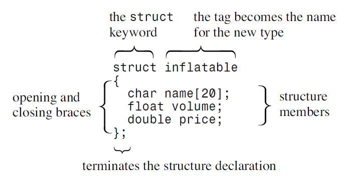

??? example "structur.cpp, example use of structure."
    <!--codeinclude-->
    [](../programs/structur.cpp)
    <!--/codeinclude-->

`structures` can be declared outside any function, which is called `external declaration`

#### C++11 Initialization

```cpp
inflatable duck {"Daphne", 0.12, 9.98}; // can omit the = in C++11
inflatable mayor {}; // individual members being set to 0
```

Narrowing is not allowed.

#### Other `structure` properties

`memberwise assignment` - you can use the assignment operator (=) to assign one
structure to another of the same type.

??? example "assgn_st.cpp, example use of memberwise assignment."
    <!--codeinclude-->
    [](../programs/assgn_st.cpp)
    <!--/codeinclude-->

#### Arrays of Structures

```cpp
inflatable gifts[100]; // array of 100 inflatable structures
...
cin >> gifts[0].volume; // use volume member of first struct
cout << gifts[99].price << endl; // display price member of last struct

inflatable guests[2] = // initializing an array of structs
{
    {"Bambi", 0.5, 21.99}, // first structure in array
    {"Godzilla", 2000, 565.99} // next structure in array
};
```

??? example "arrstruct.cpp, array of structures."
    <!--codeinclude-->
    [](../programs/arrstruct.cpp)
    <!--/codeinclude-->

#### Bit Fields in Structures

C++, like C, enables you to specify structure members that occupy
a particular number of bits

```cpp
struct torgle_register
{
    u`nsigned int SN : 4; // 4 bits for SN value
    unsigned int : 4; // 4 bits unused
    bool goodIn : 1; // valid input (1 bit)
    b`ool goodTorgle : 1; // successful torgling
};

torgle_register tr = { 14, true, false };
...
if (tr.goodIn)
```

#### Unions

A union is a data format that can hold different data types but
only one type at a time

```cpp
union one4all
{
    int int_val;
    long long_val;
    double double_val;
};

one4all pail;
pail.int_val = 15; // store an int
cout << pail.int_val;
pail.double_val = 1.38; // store a double, int value is lost
cout << pail.double_val;
```

`anonymous union` - has no name; in essence, its members become
variables that share the same address.

```cpp
struct widget
{
    char brand[20];
    int type;
    union // anonymous union
    {
        long id_num; // type 1 widgets
        char id_char[20]; // other widgets
    };
};
...
widget prize;
...
if (prize.type == 1)
cin >> prize.id_num;
else
cin >> prize.id_char;
```

#### Enumerations

`enum` facility provides an alternative to `const` for creating symbolic constants

```cpp
enum spectrum {red, orange, yellow, green, blue, violet, indigo, ultraviolet};
```

- It makes spectrum the name of a new type; spectrum is termed an enumeration,
much as a struct variable is called a structure.
- It establishes red, orange, yellow, and so on, as symbolic constants for the
integer values 0–7.These constants are called enumerators.

```cpp
spectrum band; // band a variable of type spectrum

band = blue; // valid, blue is an enumerator
band = 2000; // invalid, 2000 not an enumerator

band = orange; // valid
++band; // not valid, ++ discussed in Chapter 5
band = orange + red; // not valid, but a little tricky

int color = blue; // valid, spectrum type promoted to int
band = 3; // invalid, int not converted to spectrum
color = 3 + red; // valid, red converted to int

band = spectrum(3); // typecast 3 to type spectrum
band = spectrum(40003); // undefined
```

#### Setting Enumerator Values

```cpp
enum bits{one = 1, two = 2, four = 4, eight = 8};
enum bigstep{first, second = 100, third};
enum {zero, null = 0, one, numero_uno = 1};
```

##### Range of enumerations

```cpp
enum bits{one = 1, two = 2, four = 4, eight = 8};
bits myflag;
// In this case, the following is valid:
myflag = bits(6); // valid, because 6 is in bits range
```

Here `6` is not one of the enumerations, but it lies in the range the
enumerations define. The range is defined as follows. First, to find
the upper limit, you take the largest enumerator value.Then you find
the smallest power of two greater than this largest value and subtract one;
the result is the upper end of the range (For example, the largest `bigstep`
value, as previously defined, is 101. The smallest power of two greater
than this is 128, so the upper end of the range is 127.)

#### Pointers and the Free Store

**address operator**, represented by `&` to a variable to get its location;
if `home` is a variable, `&home` is its address

??? example "address.cpp"
    <!--codeinclude-->
    [](../programs/address.cpp)
    <!--/codeinclude-->

??? note "Pointers and the C++ Philosophy"
    Object-oriented programming differs from traditional procedural programming in that OOP
    emphasizes making decisions during runtime instead of during compile time. Runtime
    means while a program is running, and compile time means when the compiler is putting a
    program together. A runtime decision is like, when on vacation, choosing what sights to see
    depending on the weather and your mood at the moment, whereas a compile-time decision
    is more like adhering to a preset schedule, regardless of the conditions.
    Runtime decisions provide the flexibility to adjust to current circumstances. For example,
    consider allocating memory for an array. The traditional way is to declare an array. To
    declare an array in C++, you have to commit yourself to a particular array size. Thus, the
    array size is set when the program is compiled; it is a compile-time decision. Perhaps you
    think an array of 20 elements is sufficient 80% of the time but that occasionally the program
    will need to handle 200 elements. To be safe, you use an array with 200 elements.
    This results in your program wasting memory most of the time it’s used. OOP tries to make
    a program more flexible by delaying such decisions until runtime. That way, after the program
    is running, you can tell it you need only 20 elements one time or that you need 205
    elements another time.
    In short, with OOP you would like to make the array size a runtime decision. To make this
    approach possible, the language has to allow you to create an array—or the equivalent—
    while the program runs. The C++ method, as you soon see, involves using the keyword new
    to request the correct amount of memory and using pointers to keep track of where the
    newly allocated memory is found.
    Making runtime decisions is not unique to OOP. But C++ makes writing the code a bit more
    straightforward than does C.

A special type of variable the `pointer` — holds the address of a value.
Thus, the name of the pointer represents the location

Applying the `*` operator, called the indirect value or the dereferencing operator,
yields the value at the location.

??? example "pointer.cpp"
    <!--codeinclude-->
    [](../programs/pointer.cpp)
    <!--/codeinclude-->


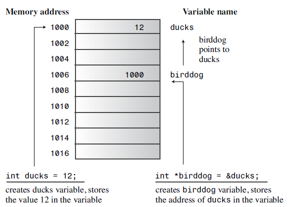

In C++, the combination `int *` is a compound type, pointer-to-int.

``` cpp
int * p_updates;

// the following declaration creates one pointer (p1) and one ordinary int (p2):
int* p1, p2;

double * tax_ptr; // tax_ptr points to type double
char * str; // str points to type char
```

??? example "init_ptr.cpp, initialize a pointer to an address."
    <!--codeinclude-->
    [](../programs/init_ptr.cpp)
    <!--/codeinclude-->

#### Pointer Danger

```cpp
long * fellow; // create a pointer-to-long
*fellow = 223323; // place a value in never-never land

// Pointer Golden Rule: Always initialize a pointer to a definite and
// appropriate address before you apply the dereferencing operator (*) to it.

int * pt;
pt = 0xB8000000; // type mismatch

int * pt;
pt = (int *) 0xB8000000; // types now match
```

#### Allocating Memory with `new`

In C, you can allocate memory with the library function `malloc()`

```cpp
// typeName * pointer_name = new typeName;
int * pn = new int;

// for comparison
int higgens;
int * pt = &higgens;
```

We say that `pn` points to a `data object`

??? example "use_new.cpp, use new."
    <!--codeinclude-->
    [](../programs/use_new.cpp)
    <!--/codeinclude-->

??? note "Out of Memory?"
    It’s possible that a computer might not have sufficient memory available to satisfy a new
    request. When that is the case, new normally responds by throwing an exception, an errorhandling
    technique discussed in Chapter 15, “Friends, Exceptions, and More.” In older implementations
    new returns the value 0. In C++, a pointer with the value 0 is called the null
    pointer. C++ guarantees that the null pointer never points to valid data, so it is often used to
    indicate failure for operators or functions that otherwise return usable pointers. The if
    statement, discussed in Chapter 6, helps you deal with this possibility. For now, the important
    point is that C++ provides the tools to detect and respond to allocation failures.

#### Freeing Memory with `delete`

This removes the memory to which ps points; it doesn’t remove the pointer ps itself.
Memory that you return, or `free`, can then be reused by other parts of the program

```cpp
int * ps = new int; // allocate memory with new
. . . // use the memory
delete ps; // free memory with delete when done

int * ps = new int; // ok
delete ps; // ok
delete ps; // not ok now
int jugs = 5; // ok
int * pi = &jugs; // ok
delete pi; // not allowed, memory not allocated by new

// Ordinarily, you won’t create two pointers to the same block of memory because that
// raises the possibility that you will mistakenly try to delete the same block twice.
int * ps = new int; // allocate memory
int * pq = ps; // set second pointer to same block
delete pq; // delete with second pointer
```

#### Using `new` to Create Dynamic Arrays

```cpp
//type_name * pointer_name = new type_name [num_elements];
int * psome = new int [10]; // get a block of 10 ints
delete [] psome; // free a dynamic array

int * pt = new int;
short * ps = new short [500];
delete [] pt; // effect is undefined, don't do it
delete ps; // effect is undefined, don't do it
```

- Don’t use delete to free memory that new didn’t allocate.
- Don’t use delete to free the same block of memory twice in succession.
- Use delete [] if you used new [] to allocate an array.
- Use delete (no brackets) if you used new to allocate a single entity.
- It’s safe to apply delete to the null pointer (nothing happens).

??? example "arraynew.cpp, use dynamic array"
    <!--codeinclude-->
    [](../programs/arraynew.cpp)
    <!--/codeinclude-->

#### Pointers, Arrays, and Pointer Arithmetic

??? example "addpntrs.cpp, pointer addition"
    <!--codeinclude-->
    [](../programs/addpntrs.cpp)
    <!--/codeinclude-->


<details><summary>
     The Address of an Array
    </summary>

Taking the address of an array is another case in which the name of an array is not interpreted
as its address. But wait, isn’t the name of an array interpreted as the address of the
array? Not quite—the name of the array is interpreted as the address of the first element of
an array, whereas applying the address operator yields the address of the whole array:

`short tell[10]; // tell an array of 20 bytes`
`cout << tell << endl; // displays &tell[0]`
`cout << &tell << endl; // displays address of whole array`

Numerically, these two addresses are the same, but conceptually `&tell[0]`, and hence
tell, is the address of a 2-byte block of memory, whereas `&tell` is the address of a 20-
byte block of memory. So the expression tell + 1 adds 2 to the address value, whereas
`&tell + 1` adds 20 to the address value. Another way of expressing this is to say that
tell is type pointer-to-short, or `short *`, and `&tell` is type pointer-to-array-of-20-shorts,
or short [*](20).
Now you might be wondering about the genesis of that last type description. First, here is
how you could declare and initialize a pointer of that type:

`short (*pas)[20] = &tell; // pas points to array of 20 shorts`

If you omit the parentheses, precedence rules would first associate [20] with pas, making
pas an array of 20 pointers-to-short, so the parentheses are necessary. Next, if you wish to
describe the type of a variable, you can use the declaration of that variable as a guide and
remove the variable name. Thus, the type of pas is `short (*)[20]`. Also note that
because pas is set to `&tell`, *pas is equivalent to tell, so `(*pas)[0]` would be the first
element of the `tell` array.
</details><br>

#### `pointer` Summary

##### Declaring Pointers

To declare a pointer to a particular type, use this form:

```cpp
typeName * pointerName;
```

Here are some examples:

```cpp
double * pn; // pn can point to a double value
char * pc; // pc can point to a char value
```

Here pn and pc are pointers, and double *and char* are the C++ notations for
the types pointer-to-double and pointer-to-char.

##### Assigning Values to Pointers

You should assign a memory address to a pointer.You can apply the & operator
to a variable name to get an address of named memory, and the new operator returns
the address of unnamed memory.

Here are some examples:

```cpp
double * pn; // pn can point to a double value
double * pa; // so can pa
char * pc; // pc can point to a char value
double bubble = 3.2;
pn = &bubble; // assign address of bubble to pn
pc = new char; // assign address of newly allocated char memory to pc
pa = new double[30]; // assign address of 1st element of array of 30 double to pa
```

##### Dereferencing Pointers

Dereferencing a `pointer` means referring to the pointed-to value.
You apply the dereferencing, or indirect value, operator (`*`) to a
`pointer` to `dereference` it. Thus, if `pn` is a `pointer` to `bubble`,
as in the preceding example, then `*pn` is the pointed-to value, or 3.2,
in this case.

Here are some examples:

```cpp
cout << *pn; // print the value of bubble
*pc = 'S'; // place 'S' into the memory location whose address is pc
```

Array notation is a second way to dereference a pointer; for instance, `pn[0]`
is the same as `*pn`. You should never dereference a pointer that has not been
initialized to a proper address.

##### Distinguishing Between a Pointer and the Pointed-to Value

Remember, if pt is a pointer-to-int, `*pt` is not a pointer-to-int; instead, `*pt`
is the complete equivalent to a type int variable. It is `pt` that is the `pointer`.

Here are some examples:

```cpp
int * pt = new int; // assigns an address to the pointer pt
*pt = 5; // stores the value 5 at that address
```

##### Array Names

In most contexts, C++ treats the name of an array as equivalent to the address
of the first element of an array.

```cpp
Here is an example:
int tacos[10]; // now tacos is the same as &tacos[0]
```

One exception is when you use the name of an array with the sizeof operator. In that
case, sizeof returns the size of the entire array, in bytes.

##### Pointer Arithmetic

C++ allows you to add an integer to a pointer.The result of adding one equals
the original address value plus a value equal to the number of bytes in the
pointed-to object. You can also subtract an integer from a pointer to take
the difference between two pointers. The last operation, which yields an integer,
is meaningful only if the two pointers point into the same array (pointing to one
position past the end is allowed, too); it then yields the separation between
the two elements.

Here are some examples:

```cpp
int tacos[10] = {5,2,8,4,1,2,2,4,6,8};
int * pt = tacos; // suppose pf and tacos are the address 3000
pt = pt + 1; // now pt is 3004 if a int is 4 bytes
int *pe = &tacos[9]; // pe is 3036 if an int is 4 bytes
pe = pe - 1; // now pe is 3032, the address of tacos[8]
int diff = pe - pt; // diff is 7, the separation between
// tacos[8] and tacos[1]
```

##### Dynamic Binding and Static Binding for Arrays

You can use an array declaration to create an array with static binding—that is,
an array  whose size is set during the compilation process:

```cpp
int tacos[10]; // static binding, size fixed at compile time
```

You use the new [] operator to create an array with dynamic binding (a dynamic array)
that is, an array that is allocated and whose size can be set during runtime.
You free the memory with delete [] when you are done:

```cpp
int size;
cin >> size;
int * pz = new int [size]; // dynamic binding, size set at run time
...
delete [] pz; // free memory when finished
```

##### Structure pointers

If the data object is a `structure` initialized with `new`, you can use the
pointer dereferencing operator (`->`) to access structure members

```cpp
BOP *stBOP = new BOP[5];

strcpy(stBOP[0].fullname, "Wimp Macho");
strcpy(stBOP[1].fullname, "Wimp Macho");

bop *stBOP = new bop;
strcpy(stBOP->fullname, "Wimp Macho");
```

The `.` operator works instead of the `->` operator because you are accessing
the members of the `bop struct` using an `array` of `structs` (`stBOP`),
not a `pointer` to a `struct`.

When you use the array notation `stBOP[0]`, it refers to the first element of
the array, which is an object of the `bop` `struct`. Therefore, you can use
the `.` operator to access its members directly.

**Use the `.` operator to access members of a `struct` or `class` directly, and**
**use the `->` operator to access members through a pointer to a `struct` or `class`.**

#### Pointers and Strings

With cout and with most C++ expressions, the name of an array of char,
a pointer-tochar, and a quoted string constant are all interpreted as the
address of the first character of a string.

The `strcpy(var_dest, var_copyFrom)` function copies a string from one location to another.
The `strncpy(var_dest, var_copyFrom, int_sizeof_var_copyFrom)` function copies
a string from one location to another with the new size of it.
The `strlen()` function returns the length of a string, not counting the null character
When using these functions, you include the `cstring` or the `string.h` header file.

??? example "ptrstr.cpp"
    <!--codeinclude-->
    [](../programs/ptrstr.cpp)
    <!--/codeinclude-->

```cpp
const char * bird = "wren"; // bird holds address of string

// you can use the pointer bird just as you would use the string "wren", as in this example:
cout << "A concerned " << bird << " speaks\n";

char food[20] = "carrots"; // initialization
strcpy(food, "flan"); // otherwise


ps = animal; // set ps to point to string
...
cout << animal << " at " << (int *) animal << endl;
cout << ps << " at " << (int *) ps << endl;

// It produces the following output:
// fox at 0x0065fd30
// fox at 0x0065fd30
```

#### Using new to Create Dynamic Structures

```cpp
inflatable * ps = new inflatable;
inflatable * ps = new inflatable[10];
```


??? example "newstrct.cpp"
    <!--codeinclude-->
    [](../programs/newstrct.cpp)
    <!--/codeinclude-->

##### Using `new` and `delete`

??? example "delete.cpp"
    <!--codeinclude-->
    [](../programs/delete.cpp)
    <!--/codeinclude-->

#### Automatic Storage, Static Storage, and Dynamic Storage

Ordinary variables defined inside a function use automatic storage and are
called automatic variables.
Automatic variables typically are stored on a `stack`.

Static storage is storage that exists throughout the execution of an entire program.
There are two ways to make a variable static.

The new and delete operators provide a more flexible approach than automatic
and static variables.They manage a pool of memory, which C++ refers to as
the `free` store or `heap`.

#### Combinations of Types

??? example "mixtypes.cpp"
    <!--codeinclude-->
    [](../programs/mixtypes.cpp)
    <!--/codeinclude-->

#### Array Alternatives - `vector`

`vector` class does use new and delete to manage memory, but it does so automatically.

```cpp
vector<typeName> vt(n_elem);
```

```cpp
#include <vector>
...
using namespace std;
vector<int> vi; // create a zero-size array of int
int n;
cin >> n;
vector<double> vd(n); // create an array of n doubles
```

We say that vi is an object of type vector<int> and that vd is an object of type vector<double>.

**C++11 `array` Template Class**

Comparing Arrays, Vector Objects, and Array Objects

??? example "choices.cpp"
    <!--codeinclude-->
    [](../programs/choices.cpp)
    <!--/codeinclude-->

Pointers and arrays are closely connected. If ar is an array name, then the expression
`ar[i]`is interpreted as `*(ar + i)`, with the array name interpreted as the address
of the first element of the array. Thus, the array name plays the same role as a pointer.

##### Assign safety

```cpp
// a2[-2] = .5; // still allowed (out of range)
a2.at(1) = 2.3; // assign 2.3 to a2[1] 
```

The difference between using bracket notation and the `at()` member function is
that if you use `at()`, an invalid index is caught during runtime and the program,
by default, aborts.

## Chapter 5: Loops and Relational Expressions

<details><summary>
        List of what you will learn
    </summary>

```cpp
 - The for loop 
 - Expressions and statements 
 - The increment and decrement operators: ++ and -- 
 - Combination assignment operators 
 - Compound statements (blocks) 
 - The comma operator 
 - Relational operators: >, >=, ==, <=, <, and != 
 - The while loop 
 - The typedef facility 
 - The do while loop 
 - The get() character input method 
 - The end-of-file condition 
 - Nested loops and two-dimensional arrays 
```

</details> <br>

### Loops, Expressions and Statements

You can’t assign a for loop to a variable. In the following example,
the for loop is not an expression, so it has no value and you can’t assign it:

```cpp
int fx = for (i = 0; i< 4; i++)
cout >> i; // not possible

for (expression; expression; expression)
    statement
```

??? example "formore.cpp - factorials in cpp"
    <!--codeinclude-->
    [](../programs/formore.cpp)
    <!--/codeinclude-->

??? example "forstr1.cpp - (string) letters in reverse order"
    <!--codeinclude-->
    [](../programs/forstr1.cpp)
    <!--/codeinclude-->

Consider this statement:

```cpp
y = (4 + x++) + (6 + x++);
```

The expression `4 + x++` is not a full expression, so C++ does not guarantee
that `x` will be incremented immediately after the subexpression `4 + x++` is evaluated.
Here the full expression is the entire assignment statement, and the semicolon marks
the sequence point, so all that C++ guarantees is that x will have been incremented
twice by the time the program moves to the following statement. C++ does not specify
whether x is incremented after each subexpression is evaluated or only after all
the expressions have been evaluated, which is why you should avoid statements
of this kind.

### Prefix & Postfix

postfix version works by first stashing a copy of the value, incrementing the
value, and then returning the stashed copy.Thus, for classes, the prefix version
is a bit more efficient than the postfix version.

In short, for built-in types, it most likely makes no difference which form you use.
For user-defined types having user-defined increment and decrement operators,
the prefix form is more efficient.

The right-to-left association rule for prefix operators implies that `*++pt`
means first apply `++` to `pt` (because the `++` is to the right of the `*`)
and then apply `*` to the new value of pt:

```cpp
double x = *++pt; // increment pointer, take the value; i.e., arr[2], or 23.4
++*pt; // increment the pointed to value; i.e., change 23.4 to 24.4
(*pt)++; // increment pointed-to value
x = *pt++; // dereference original location, then increment pointer
```

**Incrementing and decrementing pointers follow pointer arithmetic rules.**
**Thus, if pt points to the first member of an array, ++pt changes pt so**
**that it points to the second member.**

---

#### Assignment Operators

```cpp
+= Assigns L + R to L
-= Assigns L - R to L
*= Assigns L * R to L
/= Assigns L / R to L
%= Assigns L % R to L
```

#### Relational Operators

```cpp
<< Is less than
<= Is less than or equal to
== Is equal to
> Is greater than
>= Is greater than or equal to
!= Is not equal to
```

### Compound Statements, or Blocks, Syntax Tricks

??? example "block.cpp - Example of local code block"
    <!--codeinclude-->
    [](../programs/block.cpp)
    <!--/codeinclude-->

```cpp
++j, --i // two expressions count as one for syntax purposes
int i, j; // comma is a separator here, not an operator
```

??? example "forstr2.cpp - Example of comma separator trick"
    <!--codeinclude-->
    [](../programs/forstr2.cpp)
    <!--/codeinclude-->

The relational operators have a lower precedence than the arithmetic operators.That
means this expression:
`x + 3 > y - 2 // Expression 1`
corresponds to this:
`(x + 3) > (y - 2) // Expression 2`
and not to the following:
`x + (3 > y) - 2 // Expression 3`

```cpp
strcmp(word, "mate") != 0 // strings are not the same
```

??? example "compstr1.cpp - Example comparison c-string in search for word"
    <!--codeinclude-->
    [](../programs/compstr1.cpp)
    <!--/codeinclude-->

??? example "compstr2.cpp - Example comparison string class in search for word"
    <!--codeinclude-->
    [](../programs/compstr2.cpp)
    <!--/codeinclude-->

### When use other loop forms

??? example "while.cpp - while for verticalized and ASCIIized string class input"
    <!--codeinclude-->
    [](../programs/while.cpp)
    <!--/codeinclude-->

You can rewrite the while line this way:

```cpp
while (name[i])
```

because when `name[i]` is an ordinary character, its value is the character code,
which is nonzero, or true. But when name[i] is the null character,
its character-code value is 0, or false.This notation is more concise
(and more commonly used)

### Time-Delay Loop

ctime header file (time.h on less current implementations) provides solution:

- First, it defines a symbolic constant, CLOCKS_PER_SEC, that equals the number
of system time units per second. (So dividing the system time by this value yields seconds)
- Or you can multiply seconds by CLOCKS_PER_SEC to get time in the system units.
- ctime establishes clock_t as an alias for the clock() return type.
(See the sidebar “Type Aliases,” later in this chapter.) This means you can
declare a variable as type clock_t, and the compiler converts it to long or
unsigned int or whatever is the proper type for your system.

??? example "waiting.cpp - using clock() in a time-delay loop"
    <!--codeinclude-->
    [](../programs/waiting.cpp)
    <!--/codeinclude-->

<details><summary>
     Type Aliases
    </summary>

C++ has two ways to establish a new name as an alias for a type.
One is to use the preprocessor:

```cpp
#define BYTE char // preprocessor replaces BYTE with char
```

The preprocessor then replaces all occurrences of BYTE with char when you
compile a program, thus making `BYTE` an alias for `char`.
The second method is to use the C++ (and C) keyword `typedef` to create an alias.
For example, to make byte an alias for `char`, you use this:

```cpp
typedef char byte; // makes byte an alias for char
typedef typeName aliasName; // general form
```

In other words, if you want `aliasName` to be an alias for a particular type,
you declare `aliasName` as if it were a variable of that type and then prefix
the declaration with the `typedef` keyword. For example, to make `byte_pointer`
an alias for pointer-to-char, you could declare `byte_pointer` as a pointer-to-char
and then stick `typedef` in front:

```cpp
typedef char * byte_pointer; // pointer to char type
```

You could try something similar with #define, but that wouldn’t work if you
declared a list of variables. For example, consider the following

```cpp
#define FLOAT_POINTER float *
FLOAT_POINTER pa, pb;

//Preprocessor substitution converts the declaration to this:
float * pa, pb; // pa a pointer to float, pb just a float
```

The `typedef` approach doesn’t have that problem. Its ability to handle more complex type
aliases makes using `typedef` a better choice than #define—and sometimes it is the
only choice.

Notice that `typedef` doesn’t create a new type. It just creates a new name for an old type.
If you make `word` an alias for `int`, `cout` treats a type `word` value as the `int` it really is.
</details><br>

??? example "dowhile.cpp - for user input in loop (instead strange for loops)"
    <!--codeinclude-->
    [](../programs/dowhile.cpp)
    <!--/codeinclude-->

#### The Range-Based `for` Loop (C++11)

```cpp
double prices[5] = {4.99, 10.99, 6.87, 7.99, 8.49};
for (double x : prices)
    cout << x << std::endl; // Here x initially represents the first member of the prices array
```

To modify array values, you need a different syntax for the loop variable:

```cpp
for (double &x : prices)
x = x * 0.80; //20% off sale
```

It can be used with initialization lists

```cpp
for (int x : {3, 5, 2, 8, 6})
cout << x << " ";
cout << ‘\n’;
```

### Loops and Text Input

??? example "textin1.cpp - reading chars with a while loop, enter # to quit - cin() PROBLEMS"
    <!--codeinclude-->
    [](../programs/textin1.cpp)
    <!--/codeinclude-->

??? example "textin2.cpp - reading chars with a while loop, enter # to quit - cin.get(char) SOLUTION"
    <!--codeinclude-->
    [](../programs/textin2.cpp)
    <!--/codeinclude-->

### End-of-File Condition and Read data from keyboard

The program to take input from the `fishtale` file instead of from the
**keyboard**. The `<` symbol is the redirection operator for both Unix
and the Windows Command Prompt mode.

```sh
gofish <fishtale
```

When `cin` detects the `EOF`, it sets two bits (the `eofbit` and the `failbit`) to 1.
You can use a member function named `eof()` to see whether the `eofbit` has been set;
the call `cin.eof()` returns the bool value true if the `EOF` has been detected and false otherwise

Some systems do not support simulated EOF from the keyboard.
Other systems support it imperfectly. If you have been using cin.get() to
freeze the screen until you can read it, that won’t work here because detecting
the EOF turns off further attempts to read input.

??? example "textin3.cpp - reading chars till EOF (keyboard break)"
    <!--codeinclude-->
    [](../programs/textin3.cpp)
    <!--/codeinclude-->

The following is the essential design of a loop intended to read text
a character at a time until EOF:

```cpp
cin.get(ch); // attempt to read a char
while (cin.fail() == false) // test for EOF
{
    ... // do stuff
    cin.get(ch); // attempt to read another char
}

// you can use instead:
while (!cin.fail()) // while input has not failed  (`!` - 'not true' operator)

// This is a bit more general than using !cin.fail() or !cin.eof() because it detects
// other possible causes of failure, such as disk failure
while (cin) // while input is successful
```

`cin.get(ch)` can condense loop above:
Here, `cin.get(char)` is called once in the test condition instead of twice—once
before the loop and once at the end of the loop.

```cpp
while (cin.get(ch)) // while input is successful
{
... // do stuff
}
```

The cin.get() member function with no arguments returns the next character from
the input.That is, you use it in this way: `ch = cin.get();`
(Recall that cin.get(ch) returns an object, not the character read.)
Similarly, you can use the `cout.put(ch)`

??? example "textin4.cpp - incorporates the cin.get() and codense code"
    <!--codeinclude-->
    [](../programs/textin4.cpp)
    <!--/codeinclude-->

| Property                                  | `cin.get(ch)`                                            | `ch=cin.get()`                              |
|-------------------------------------------|----------------------------------------------------------|---------------------------------------------|
| Method for conveying input character      | Assign to argument ch                                    | Use function return value to assign to `ch` |
| Function return value for character input | A class `istream` object (true after `bool` conversion)  | Code for character as type `int` value      |
| Function return value at EOF              | A class `istream` object (false after `bool` conversion) | EOF                                         |

### Nested Loops and Two-Dimensional Arrays

 Initialize

```cpp
int maxtemps[4][5] = // 2-D array
{
{96, 100, 87, 101, 105}, // values for maxtemps[0]
{96, 98, 91, 107, 104}, // values for maxtemps[1]
{97, 101, 93, 108, 107}, // values for maxtemps[2]
{98, 103, 95, 109, 108} // values for maxtemps[3]
};
```

??? example "nested.cpp - nested loops and 2-D array"
    <!--codeinclude-->
    [](../programs/nested.cpp)
    <!--/codeinclude-->

## Chapter 6: Branching Statements and Logical Operators

<details><summary>
        List of what you will learn
    </summary>

```cpp
 - The `if` statement
 - The `if else` statement
 - Logical operators: `&&`, `||`, and `!`
 - The `cctype` library of character functions
 - The conditional operator: `?:`
 - The switch statement
 - The continue and break statements
 - Number-reading loops
 - Basic file input/output
```

</details>

### Statements and logical operators

??? example "if.cpp - (count spaces in while) simple use of if statement"
    <!--codeinclude-->
    [](../programs/if.cpp)
    <!--/codeinclude-->

??? example "ifelse.cpp - (simplest cipher from keyboard) simple use of if else statement"
    <!--codeinclude-->
    [](../programs/ifelse.cpp)
    <!--/codeinclude-->

??? example "ifelseif.cpp -  simple use of if elseif else statement for guess game"
    <!--codeinclude-->
    [](../programs/ifelseif.cpp)
    <!--/codeinclude-->

#### Conditional Operators and Bug Prevention

Many programmers reverse the more intuitive expression `variable == value` to
`value == variable` in order to catch errors where the equality is mistyped as
an assignment operator. For example, entering the conditional as follows is
valid and will work properly: `if (3 == myNumber)`
However, if you happen to mistype as follows, the compiler will generate an
error message because it believes you are attempting to assign a value to a
literal (3 always equals 3 and can’t be assigned another value):
`if (3 = myNumber)`
Suppose you made a similar mistake, using the former notation:
`if (myNumber = 3)`
The compiler would simply assign the value 3 to myNumber, and the block within
the if would run—a very common error, and a difficult error to find.
(However, many compilers will issue a warning, which you would be wise to heed.)
As a general rule, writing code that allows the compiler to find errors is much
easier than repairing the causes of mysterious faulty results.

### Logical expressions

`||` - Logical OR Operator is true, when one or both of two conditions satisfy a requirement.
`&&` - Logical AND Operator is true only if both of the original expressions are true.
`!` - Logical NOT Operator negates, or reverses the truth value of, the expression that follows it.

logical OR and logical AND operators have a lower precedence than relational operators.
This means that an expression such as this: `x > 5 && x < 10` is interpreted this way:
`(x > 5) && (x < 10)`

The logical AND operator has a higher precedence than the logical OR, Thus this
expression: `age > 30 && age < 45 || weight > 300`, means the following:
`(age > 30 && age < 45) || weight > 300`

C++ guarantees that when a program evaluates a logical expression, it evaluates
it from left to right and stops evaluation as soon as it knows what the answer is.

??? example "or.cpp - simple use of the logical OR operator"
    <!--codeinclude-->
    [](../programs/or.cpp)
    <!--/codeinclude-->

??? example "and.cpp - simple use of the logical AND operator"
    <!--codeinclude-->
    [](../programs/and.cpp)
    <!--/codeinclude-->

??? example "more_and.cpp - range using AND operator"
    <!--codeinclude-->
    [](../programs/more_and.cpp)
    <!--/codeinclude-->

??? example "not.cpp - simple use of NOT operator"
    <!--codeinclude-->
    [](../programs/not.cpp)
    <!--/codeinclude-->

### Range Tests

Note that each part of a range test should use the AND operator to join
two complete relational expressions:
`if (age > 17 && age < 35) // OK`
Don’t borrow from mathematics and use the following notation:
`if (17 < age < 35) // Don't do this!`
If you make this mistake, the compiler won’t catch it as an error because
it is still valid C++ syntax. The `<` operator associates from left to right,
so the previous expression means the following:
`if ( (17 < age) < 35)`
But `17 < age` is either `true`, or `1`, or else `false`, or `0`. In either case,
the expression `17 < age` is less than 35, so the entire test is always true!

### `cctype` library of Character Functions

simplify such tasks as determining whether a character is an uppercase letter
or a digit or punctuation

Using these functions is more convenient than using the AND and OR operators.
For example, here’s how you might use AND and OR to test whether a character
`ch` is an alphabetic character:

```cpp
if ((ch >= 'a' && ch <= 'z') || (ch >= 'A' && ch <= 'Z'))
```

Is equivalent to:

```cpp
if (isalpha(ch))
```

In program `cctypes.cpp` below
`isalpha()`,  tests for alphabetic characters;
`isdigits()`,  tests for digit characters, such as 3;
`isspace()`, tests for whitespace characters, such as newlines, spaces, and tabs;
`ispunct()`,  tests for punctuation characters

??? example "cctypes.cpp - demonstrates some functions of the ctype.h library"
    <!--codeinclude-->
    [](../programs/cctypes.cpp)
    <!--/codeinclude-->

Function Name

- `isalnum()` - returns true if the argument is alphanumeric (that is, a letter or a digit).
- `isalpha()` - returns true if the argument is alphabetic.
- `isblank()` - returns true if the argument is a space or a horizontal tab.
- `iscntrl()` - returns true if the argument is a control character.
- `isdigit()` - returns true if the argument is a decimal digit (0–9).
- `isgraph()` - returns true if the argument is any printing character other than a space.
- `islower()` - returns true if the argument is a lowercase letter.
- `isprint()` - returns true if the argument is any printing character, including a space.
- `ispunct()` - returns true if the argument is a punctuation character.
- `isspace()` - returns true if the argument is a standard whitespace character
(that is, a space, formfeed, newline, carriage return, horizontal tab, vertical tab).
- `isupper()` - returns true if the argument is an uppercase letter.
- `isxdigit()` - returns true if the argument is a hexadecimal digit character
(that is, 0–9, a–f, or A–F).
- `tolower()` - If the argument is an uppercase character, tolower() returns
the lowercase version of that character; otherwise, it returns the argument unaltered.
- `toupper()` - If the argument is a lowercase character, toupper() returns the
uppercase version of that character; otherwise, it returns the argument unaltered.

### The `?:` Operator

`expression1 ? expression2 : expression3`
If `expression1` is `true`, then the value of the whole conditional expression
is the value of `expression2`. Otherwise, the value of the whole expression
is the value of `expression3`.

```cpp
5 > 3 ? 10 : 12 // 5 > 3 is true, so expression value is 10
3 == 9 ? 25 : 18 // 3 == 9 is false, so expression value is 18
```

??? example "condit.cpp - example of ?: use"
    <!--codeinclude-->
    [](../programs/condit.cpp)
    <!--/codeinclude-->

### The `switch` Statement

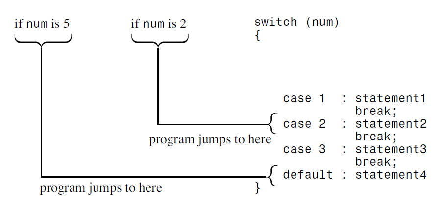
<br>

??? example "switch.cpp - menu program, example of switch use"
    <!--codeinclude-->
    [](../programs/switch.cpp)
    <!--/codeinclude-->

??? example "enum.cpp - menu program with enum labels"
    <!--codeinclude-->
    [](../programs/enum.cpp)
    <!--/codeinclude-->

### The break and continue Statements

`break` statement causes program execution to pass to the next statement
following the switch or the loop
`continue` statement is used in loops and causes a program to skip the
rest of the body of the loop

??? example "jump.cpp - using continue and break"
    <!--codeinclude-->
    [](../programs/jump.cpp)
    <!--/codeinclude-->

??? example "cinfish.cpp - to terminate input before filling the array example"
    <!--codeinclude-->
    [](../programs/cinfish.cpp)
    <!--/codeinclude-->

??? example "cingolf.cpp - to terminate input before filling the array example and reset cin to accept new input."
    <!--codeinclude-->
    [](../programs/cingolf.cpp)
    <!--/codeinclude-->

### File Input/Output

#### Write to file

You have to declare your own `ofstream` object, choosing a name for it and
associating it with a file.

Declaration:

```cpp
ofstream outFile; // outFile an ofstream object
ofstream fout; // fout an ofstream object
```

Association with file (`open()` method requires a C-style string as its argument):

```cpp
outFile.open("fish.txt"); // outFile used to write to the fish.txt file
char filename[50];
cin >> filename; // user specifies a name
fout.open(filename); // fout used to read specified file
```

Use created object (after you’ve declared an ofstream object and associated
it with a file, you use it exactly as you would use cout):

```cpp
double wt = 125.8;
outFile << wt; // write a number to fish.txt
char line[81] = "Objects are closer than they appear.";
fout << line << endl; // write a line of text
```

Main steps for using file output:

1. Include the fstream header file.
2. Create an ofstream object.
3. Associate the ofstream object with a file.
4. Use the ofstream object in the same manner you would use cout.

??? example "outfile.cpp - write data to file."
    <!--codeinclude-->
    [](../programs/outfile.cpp)
    <!--/codeinclude-->

#### Read from file

You have to declare your own `ifstream` object, choosing a name for it and
associating it with a file

Declaration:

```cpp
ifstream inFile; // inFile an ifstream object
ifstream fin; // fin an ifstream object
```

Association with file (open() method requires a C-style string as its argument):

```cpp
inFile.open("bowling.txt"); // inFile used to read bowling.txt file
char filename[50];
cin >> filename; // user specifies a name
fin.open(filename); // fin used to read specified file
```

Use created object:

```cpp
double wt;
inFile >> wt; // read a number from bowling.txt
char line[81];
fin.getline(line, 81); // read a line of text
```

Check for nonexisting file (`is_open()` method)

```cpp
inFile.open("bowling.txt");
if (!inFile.is_open()){
    exit(EXIT_FAILURE);
}
```

For program below - write `datsumafile.txt`, that should be local,
or `.\programs\datsumafile.txt` if compiled in `$PATH$`

??? example "sumafile.cpp - reading double data from file."
    <!--codeinclude-->
    [](../programs/sumafile.cpp)
    <!--/codeinclude-->

??? example "datsumafile.txt - data for program."
    <!--codeinclude-->
    [](../programs/datsumafile.txt)
    <!--/codeinclude-->

```cpp
// standard file-reading loop design
inFile >> value; // get first value
while (inFile.good()) // while input good and not at EOF
{
    // loop body goes here
    inFile >> value; // get next value
}
```

`inFile`, when placed in a context in which a `bool` value is expected,
evaluates to `inFile.good()` — that is, to `true` or `false`, thus you
can make above code more concise:

```cpp
// abbreviated file-reading loop design
// omit pre-loop input
while (inFile >> value) // read and test for success
{
    // loop body goes here
    // omit end-of-loop input
}
```

## Chapter 7: C++’s Programming Modules

<details><summary>
        List of what you will learn
</summary>

```cpp
- Function basics
- Function prototypes
- Passing function arguments by value
- Designing functions to process arrays
- Using const pointer parameters
- Designing functions to process text strings
- Designing functions to process structures
- Designing functions to process objects of the string class
- Functions that call themselves (recursion)
- Pointers to functions
```

</details> <br>

### Functions

You can group functions into two categories: those that don’t have return values and those that do.

```cpp
void functionName(parameterList)
{
    statement(s)
    return; // optional
}
```

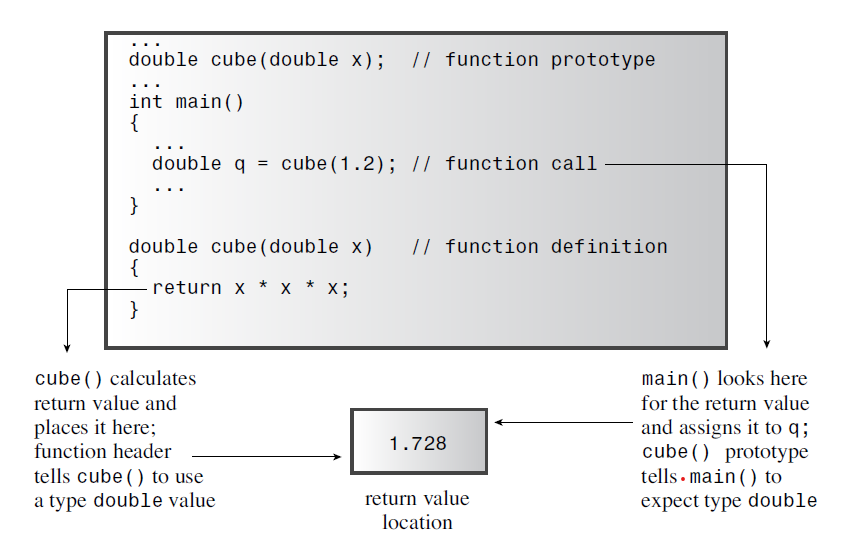
<br>

### Prototyping

Prototype describes the function interface to the compiler.That is, it tells the compiler what type of return value,
if any, the function has, and it tells the compiler the number and type of function arguments.

A function prototype is a statement, so it must have a terminating semicolon. The simplest way to get a prototype
is to copy the function header from the function definition and add a semicolon.

??? example "protos.cpp - Example of using prototypes and function calls."
    <!--codeinclude-->
    [](../programs/protos.cpp)
    <!--/codeinclude-->

<details><summary>
C++ Versus ANSI C Prototyping, ellypsis (...)
</summary>

ANSI C borrowed prototyping from C++, but the two languages do have some differences. The most important is that ANSI C,
to preserve compatibility with classic C, made prototyping optional, whereas C++ makes prototyping mandatory.
For example, consider the following function declaration:

```cpp
void say_hi();
```

In C++, leaving the parentheses empty is the same as using the keyword void within the
parentheses. It means the function has no arguments. In ANSI C, leaving the parentheses
empty means that you are declining to state what the arguments are. That is, it means
you’re forgoing prototyping the argument list. The C++ equivalent for not identifying the argument
list is to use an ellipsis:

```cpp
void say_bye(...); // C++ abdication of responsibility
```

Normally this use of an ellipsis is needed only for interfacing with C functions having a variable
number of arguments, such as printf().

</details><br>

They greatly reduce the chances of program errors. In particular, prototypes ensure the following:

- The compiler correctly handles the function return value.
- The compiler checks that you use the correct number of function arguments.
- The compiler checks that you use the correct type of arguments.
If you don’t, it converts the arguments to the correct type, if possible.

Prototyping takes place during compile time and is termed `static type checking`. `Static type checking`, as you’ve
just seen, catches many errors that are much more difficult to catch during runtime.

### Passing function arguments

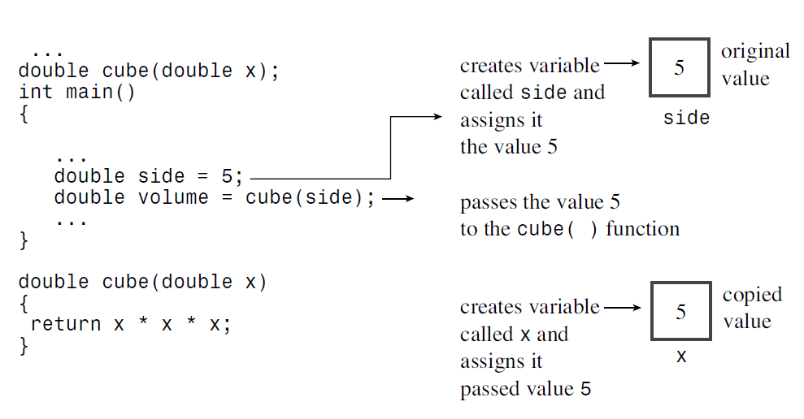
<br>

A variable that’s used to receive passed values is called a `formal argument` or `formal parameter`.
The value passed to the function is called the `actual argument` or `actual parameter`.

Variables, including parameters, declared within a function are private to the function.
When a function is called, the computer allocates the memory needed for these variables.
When the function terminates, the computer frees the memory that was used for those variables.

Prototype examples with many arguments:

```cpp
void fifi(float a, float b) // declare each variable separately
void fufu(float a, b) // NOT acceptable

void n_chars(char c, int n); // prototype, style 1
void n_chars(char, int); // prototype, style 2
```

??? example "twoarg.cpp - a function with 2 arguments."
    <!--codeinclude-->
    [](../programs/twoarg.cpp)
    <!--/codeinclude-->

??? example "lotto.cpp - calculate probability of winning."
    <!--codeinclude-->
    [](../programs/lotto.cpp)
    <!--/codeinclude-->

### Functions and Arrays

```cpp
int sum_arr(int arr[], int n) // arr = array name, n = size
```

`arr` is not really an **array**; it’s a **pointer**!
The good news is that you can write the rest of `the` function just as if arr were an array.

The design decision to use array addresses as arguments saves the time and memory needed to copy an entire array.

??? example "arrfun1.cpp - functions with an array argument."
    <!--codeinclude-->
    [](../programs/arrfun1.cpp)
    <!--/codeinclude-->

??? example "arrfun2.cpp - functions with an array argument."
    <!--codeinclude-->
    [](../programs/arrfun2.cpp)
    <!--/codeinclude-->

??? example "arrfun3.cpp - functions with an array argument."
    <!--codeinclude-->
    [](../programs/arrfun3.cpp)
    <!--/codeinclude-->

??? example "arrfun4.cpp - functions with an array range."
    <!--codeinclude-->
    [](../programs/arrfun4.cpp)
    <!--/codeinclude-->

C++ interprets an array name as the address of its first element:

```cpp
cookies == &cookies[0] // array name is address of first element
```

This suggests that the correct function header should be this:

```cpp
int sum_arr(int * arr, int n) // arr = array name, n = size

arr[i] == *(ar + i) // values in two notations
&arr[i] == ar + i // addresses in two notations

// You can also lie about where the array starts when calling:
sum = sum_arr(cookies + 4, 4);
sum = sum_arr(cookies, cookies + 3); // first 3 elements - array ranges

// Protecting array with const to keep a function from accidentally altering the contents of
an array argument,
void show_array(const double ar[], int n);
```

Remember that adding one to a pointer, including an array name, actually adds a value equal to the size, in bytes, of the
type to which the pointer points

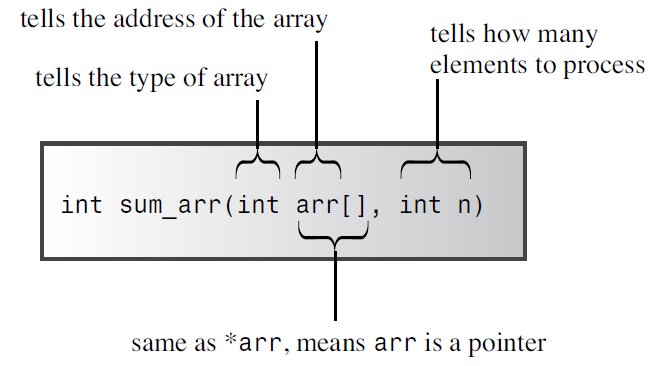
<br>

### Pointers and `const`

Pointers of variables can't be addressed to const values.

```cpp
int age = 39;
const int * pt = &age;

*pt += 1; // INVALID because pt points to a const int
cin >> *pt; // INVALID for the same reason

*pt = 20; // INVALID because pt points to a const int
age = 20; // VALID because age is not declared to be const

const float g_earth = 9.80;
const float * pe = &g_earth; // VALID

const float g_moon = 1.63;
float * pm = &g_moon; // INVALID
```

<details><summary>
Using const When You Can
    </summary>

There are two strong reasons to declare pointer arguments as pointers to constant data:

- It protects you against programming errors that inadvertently alter data.
- Using `const` allows a function to process both `const` and non-`const` actual arguments,
whereas a function that omits `const` in the prototype can accept only non-`const` data.

</details><br>

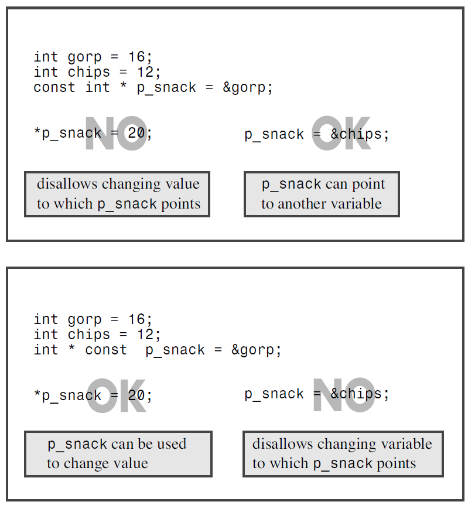
<br>

### Functions and Two-Dimensional Arrays

```cpp
int data[3][4] = {{1,2,3,4}, {9,8,7,6}, {2,4,6,8}};
int total = sum(data, 3);

// data is pointer-to-array-of-four-int,
// so an appropriate prototype would be this:
int sum(int (*ar2)[4], int size);

// The simplest way is to use brackets twice, as in ar2[r][c].
total += ar2[r][c];
// But it is possible, if ungainly, to use the * operator twice
ar2[r][c] == *(*(ar2 + r) + c) // same thing

// To understand this, you can work out the
// meaning of the subexpressions from the inside out:
ar2 // pointer to first row of an array of 4 int
ar2 + r // pointer to row r (an array of 4 int)
*(ar2 + r) // row r (an array of 4 int, hence the name of an array,
// thus a pointer to the first int in the row, i.e., ar2[r]
*(ar2 +r) + c // pointer int number c in row r, i.e., ar2[r] + c
*(*(ar2 + r) + c // value of int number c in row r, i.e. ar2[r][c]
```

### Functions and C-Style Strings

You have three choices for representing a string:

- An array of char
- A quoted string constant (also called a string literal)
- A pointer-to-char set to the address of a string

```cpp
char ghost[15] = "galloping";
char * str = "galumphing";
int n1 = strlen(ghost); // ghost is &ghost[0]
int n2 = strlen(str); // pointer to char
int n3 = strlen("gamboling"); // address of string
```

??? example "strgfun.cpp - functions with a string argument."
    <!--codeinclude-->
    [](../programs/strgfun.cpp)
    <!--/codeinclude-->

??? example "strgback.cpp - a function that returns a pointer to char."
    <!--codeinclude-->
    [](../programs/strgback.cpp)
    <!--/codeinclude-->

### Functions and Structures

Defining the structure is simple:

```cpp
struct travel_time
{
    int hours;
    int mins;
};

// Next, consider the prototype for a sum() function that
// returns the sum of two such structures
travel_time sum(travel_time t1, travel_time t2);
```

??? example "travel.cpp - using structures with functions."
    <!--codeinclude-->
    [](../programs/travel.cpp)
    <!--/codeinclude-->

??? example "strctfun.cpp - functions with a structure argument."
    <!--codeinclude-->
    [](../programs/strctfun.cpp)
    <!--/codeinclude-->

### Passing Structure Addresses

Suppose you want to save time and space by passing the address of a structure instead of passing the entire structure.

You need to make three changes:

- When calling the function, pass it the address of the structure (`&pplace`) rather than the structure itself (`pplace`).
- Declare the formal parameter to be a pointer-to-polar—that is, type polar `*`. Because the function shouldn’t modify the
structure, use the `const` modifier.
- Because the formal parameter is a pointer instead of a structure, use the indirect membership operator (`->`) rather than
the membership operator (dot).

```cpp
void show_polar (const polar * pda)
{
    cout << "distance = " << pda->distance;
}
```

??? example "strctptr.cpp - functions with a structure argument."
    <!--codeinclude-->
    [](../programs/strctptr.cpp)
    <!--/codeinclude-->

### Functions and string Class Objects

`string` class object is more closely related to a structure than to an array.

- you can assign a structure to another structure and an object to another object
- You can pass a structure as a complete entity to a function, and you can pass an object as a complete entity.
- you can declare a one-dimensional array of `string`
objects instead of a two-dimensional array of `char`.

??? example "topfive.cpp - handling an array of string objects."
    <!--codeinclude-->
    [](../programs/topfive.cpp)
    <!--/codeinclude-->

### Functions and array Objects

Declared `array` object

```cpp
std::array<double, 4> expenses;

show(expenses); // function display the contents
show(&expenses); // if we want a function that modifies object

// Prototypes
void show(std::array<double, 4> da); // da an object
void fill(std::array<double, 4> * pa); // pa a pointer to an object
```

??? example "arrobj.cpp - functions with a structure argument."
    <!--codeinclude-->
    [](../programs/arrobj.cpp)
    <!--/codeinclude-->

### Recursion

C++ function can `call` itself. This ability is termed recursion

Recursive function example

```cpp
// Single Recursive Call  
void recurs(argumentlist)
{
    statements1
    if (test)
        recurs(arguments)
    statements2
}
```

??? example "recur.cpp - using recursion (single)."
    <!--codeinclude-->
    [](../programs/recur.cpp)
    <!--/codeinclude-->

This recursive approach below is sometimes called the `divide-and-conquer` strategy.

??? example "ruler.cpp - using recursion to subdivide a ruler."
    <!--codeinclude-->
    [](../programs/ruler.cpp)
    <!--/codeinclude-->

### Pointers to Functions

it’s possible to write a function that takes the address of another function as an argument.
That enables the first function to find the second function and run it.

You need to be able to do the following:

- Obtain the address of a function.
- Declare a pointer to a function.
- Use a pointer to a function to invoke the function.

#### Obtaining the address of a function

It is simple. You just use the function name without
trailing parentheses

```cpp
process(think); // passes address of think() to process()
thought(think()); // passes return value of think() to thought()
```

#### Declaring a Pointer to a Function

Pointer to a function has to specify to what type of function the pointer point

```cpp
double pam(int); // prototype of function to use
double (*pf)(int); // pf points to a function that takes
// one int argument and that
// returns type double
```

<details><summary>
Tip
</summary>

In general, to declare a pointer to a particular kind of function, you can first write a prototype for a regular function
of the desired kind and then replace the function name with an expression in the form `(*pf)`. In this case, `pf` is a
pointer to a function of that type.
</details><br>

```cpp
double (*pf)(int); // pf points to a function that returns double
double *pf(int); // pf() a function that returns a pointer-to-double

double pam(int);
double (*pf)(int);
pf = pam; // pf now points to the pam() function

double ned(double);
int ted(int);
double (*pf)(int);
pf = ned; // invalid -- mismatched signature
pf = ted; // invalid -- mismatched return types

// prototype:
void estimate(int lines, double (*pf)(int));

estimate(50, pam); // function call telling estimate() to use pam()

// Using a Pointer to Invoke a Function
double pam(int);
double (*pf)(int);
pf = pam; // pf now points to the pam() function
double x = pam(4); // call pam() using the function name
double y = (*pf)(5); // call pam() using the pointer pf

double y = pf(5); // also call pam() using the pointer pf
```

??? example "fun_ptr.cpp - pointers to functions."
    <!--codeinclude-->
    [](../programs/fun_ptr.cpp)
    <!--/codeinclude-->

```cpp
const double * f1(const double ar[], int n);
const double * f2(const double [], int);
const double * f3(const double *, int);
```

The signatures might look different, but they are the same.

```cpp
const double * (*p1)(const double *, int);
//This can be combined with initialization:
const double * (*p1)(const double *, int) = f1;
auto p2 = f2; // C++11 automatic type deduction

*pd[3] // an array of 3 pointers
(*pd)[3] // a pointer to an array of 3 elements

**&pa == *pa == pa[0]
```

??? example "arfupt.cpp - an array of function pointers."
    <!--codeinclude-->
    [](../programs/arfupt.cpp)
    <!--/codeinclude-->

<details><summary>
Appreciating auto
    </summary>
One of the goals of C++11 is to make C++ easier to use, letting the programmer concentrate
more on design and less on details. Listing 7.19 surely illustrates this point:

```cpp
auto pc = &pa; // C++11 automatic type deduction
const double *(*(*pd)[3])(const double *, int) = &pa; // C++98, do it yourself
```

The automatic type deduction feature reflects a philosophical shift in the role of the compiler.
In C++98, the compiler uses its knowledge to tell you when you are wrong. In C++11,
at least with this feature, it uses its knowledge to help you get the right declaration.
There is a potential drawback. Automatic type deduction ensures that the type of the variable
matches the type of the initializer, but it still is possible that you might provide the
wrong type of initializer:

```cpp
auto pc = *pa; // oops! used *pa instead of &pa
```

This declaration would make pc match the type of *pa, and that would result in a compiletime
error when Listing 7.19 later uses pc, assuming that it is of the same type as &pa.

</details><br>

### Simplifying with `typedef`

```cpp
typedef double real; // makes real another name for double

// you can do this to make p_fun an alias for the function pointer type
typedef const double *(*p_fun)(const double *, int); // p_fun now a type name
p_fun p1 = f1; // p1 points to the f1() function

p_fun pa[3] = {f1,f2,f3}; // pa an array of 3 function pointers
p_fun (*pd)[3] = &pa; // pd points to an array of 3 function pointers
```

---

## Chapter 8: Adventures in Functions

<details><summary>
        List of what you will learn
</summary>

```cpp
- Inline functions
- Reference variables
- How to pass function arguments by reference
- Default arguments
- Function overloading
- Function templates
- Function template specializations
```

</details> <br>

### Inline functions

`Inline` keyword tells the compiler to consider function for `inlining`. If the function is small and called frequently, inlining it can lead to
performance improvements because the overhead of a function call is avoided.

`Inlining` - mean that the code of the function is inserted at the point where the function is called, instead of performing a regular function call.
This can potentially improve performance by avoiding the overhead of a function call, but it might increase the size of the binary file because the
function's code could be inserted in multiple places

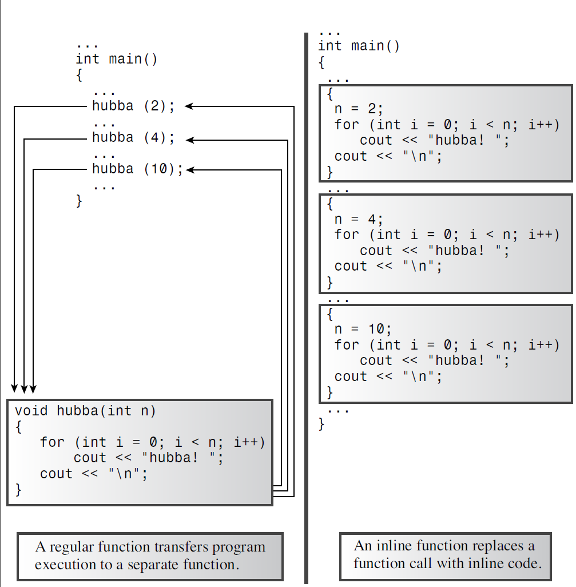
<br>

??? example "inline.cpp - using an inline function."
    <!--codeinclude-->
    [](../programs/inline.cpp)
    <!--/codeinclude-->

<details><summary>
Inline Versus Macros
    </summary>
<figure>

The `inline` facility is an addition to C++. C uses the preprocessor `#define` statement to
provide *macros*, which are crude implementations of inline code. For example, here’s a
macro for squaring a number:

```cpp
#define SQUARE(X) X*X
```

This works not by passing arguments but through text substitution, with the `X` acting as a
symbolic label for the “argument”:

```cpp
a = SQUARE(5.0); is replaced by a = 5.0*5.0;
b = SQUARE(4.5 + 7.5); is replaced by b = 4.5 + 7.5 * 4.5 + 7.5;
d = SQUARE(c++); is replaced by d = c++*c++;
```

Only the first example here works properly. You can improve matters with a liberal application
of parentheses:

Still, the problem remains that macros don’t pass by value. Even with this new definition,
SQUARE(c++) increments c twice, but the inline square() function in Listing 8.1 evaluates
c, passes that value to be squared, and then increments c once.

```cpp
#define SQUARE(X) ((X)*(X))
```

Still, the problem remains that macros don’t pass by value. Even with this new definition,
`SQUARE(c++)` increments `c` twice, but the inline `square()` function in Listing 8.1 evaluates
c, passes that value to be squared, and then increments `c` once.

The intent here is not to show you how to write C macros. Rather, it is to suggest that if you
have been using C macros to perform function-like services, you should consider converting
them to C++ inline functions

</figure>
</details><br>

### Reference Variables

reference is a name that acts as an alias, or an alternative name, for a previously defined variable. For
example, if you make `twain` a reference to the `clemens` variable, you can use `twain` and `clemens` interchangeably
to represent that variable.

Unlike po0inters you can’t declare the reference and then assign it a value later the way you can with a pointer:

```cpp
int rat;
int & rodent;
rodent = rat; // No, you can't do this.
```

??? example "firstref.cpp - defining and using a reference."
    <!--codeinclude-->
    [](../programs/firstref.cpp)
    <!--/codeinclude-->

??? example "secref.cpp - defining and using a reference."
    <!--codeinclude-->
    [](../programs/secref.cpp)
    <!--/codeinclude-->

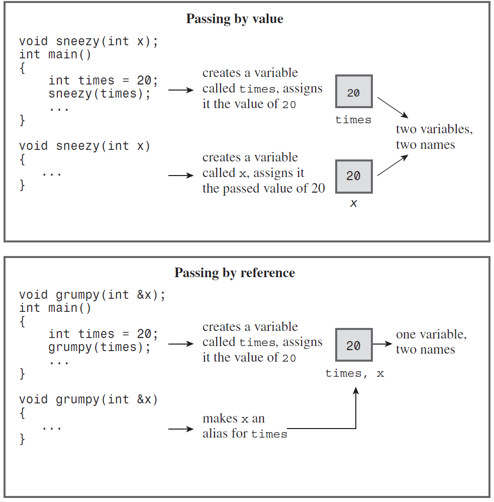
<br>

??? example "swaps.cpp - swapping with references and with pointers."
    <!--codeinclude-->
    [](../programs/swaps.cpp)
    <!--/codeinclude-->

??? example "cubes.cpp - regular and reference arguments."
    <!--codeinclude-->
    [](../programs/cubes.cpp)
    <!--/codeinclude-->

### Temporary Variables, Reference Arguments, and `const`

First, when is a temporary variable created? Provided that the reference parameter is a
const, the compiler generates a temporary variable in two kinds of situations:

- When the actual argument is the correct type but isn’t an **lvalue**
- When the actual argument is of the wrong type, but it’s of a type that can be converted
to the correct type

An argument that’s an `lvalue` is a data object that can be referenced
by `address`. For example, a variable, an array element, a structure member, a reference, and
a dereferenced pointer are lvalues.
Non-lvalues include literal constants (aside from quoted strings,
which are represented by their addresses) and expressions with multiple terms.

Regular variable can be further characterized as being a
`modifiable lvalue` and the const variable as a `non-modifiable lvalue`.

```cpp
double refcube(const double &ra)
{
return ra * ra * ra;
}

double side = 3.0;
double * pd = &side;
double & rd = side;
long edge = 5L;
double lens[4] = { 2.0, 5.0, 10.0, 12.0};
double c1 = refcube(side); // ra is side
double c2 = refcube(lens[2]); // ra is lens[2]
double c3 = refcube(rd); // ra is rd is side
double c4 = refcube(*pd); // ra is *pd is side
double c5 = refcube(edge); // ra is temporary variable
double c6 = refcube(7.0); // ra is temporary variable
double c7 = refcube(side + 10.0); // ra is temporary variable
```

<details><summary>
Note
    </summary>
<figure>

If a function call argument isn’t an `lvalue` or does not match the type of the corresponding
`const` reference parameter, C++ creates an anonymous variable of the correct type, assigns
the value of the function call argument to the anonymous variable, and has the parameter
refer to that variable.

</figure>
</details><br>

<details><summary>
Use `const` When You Can
    </summary>
<figure>

There are three strong reasons to declare reference arguments as references to constant data:

- Using `const` protects you against programming errors that inadvertently alter data.
- Using `const` allows a function to process both `const` and `non-const` actual arguments,
whereas a function that omits `const` in the prototype only can accept nonconst
data.
- Using a `const` reference allows the function to generate and use a temporary variable
appropriately.

You should declare formal reference arguments as `const` whenever it’s appropriate to do so.

</figure>
</details><br>

C++11 introduces a second kind of reference, called an rvalue reference, that can refer to
an rvalue. It’s declared using &&:

```cpp
double && rref = std::sqrt(36.00); // not allowed for double &
double j = 15.0;
double && jref = 2.0* j + 18.5; // not allowed for double &
std::cout << rref << '\n'; // display 6.0
std::cout << jref << '\n'; // display 48.5;
```

The `rvalue` reference was introduced mainly to help library designers provide more
efficient implementations of certain operations. Chapter 18,“Visiting will the New C++
Standard,” discusses how rvalue references are used to implement an approach called move
semantics.The original reference type (the one declared using a single &) is now called an
`lvalue` reference.

### Using References with a Structure

References work wonderfully with `structures` and `classes`
References were introduced primarily for use with these types, not for use with the
basic built-in types.

Suppose we have the following definition of a structure:

```cpp
struct free_throws
{
    std::string name;
    int made;
    int attempts;
    float percent;
};
```

Then a function using a reference to this type could be prototyped as follows:

```cpp
void set_pc(free_throws & ft); // use a reference to a structure
```

If the intent is that the function doesn’t alter the structure, use const:

```cpp
void display(const free_throws & ft); // don't allow changes to structure
```

??? example "strc_ref.cpp - using structure references."
    <!--codeinclude-->
    [](../programs/strc_ref.cpp)
    <!--/codeinclude-->

A function that returns a reference is actually an alias for the referred-to variable.

#### Being Careful About What a Return Reference Refers To

```cpp
const free_throws & clone2(free_throws & ft)
{
    free_throws newguy; // first step to big error
    newguy = ft; // copy info
    return newguy; // return reference to copy
}
```

This has the unfortunate effect of returning a reference to a temporary variable
(newguy) that passes from existence as soon as the function terminates.

Here’s how you could do something similar with a reference:

```cpp
const free_throws & clone(free_throws & ft)
{
    free_throws * pt;
    *pt = ft; // copy info
    return *pt; // return reference to copy
}
```

### Using References with a Class Object

The general idea is to create a function that adds a given string
to each end of another string. Listing 8.7 (strquote) provides three functions that are intended to do
this. However, one of the designs is so flawed that it may cause the program to crash or
even not compile.

??? example "strquote.cpp - different designs."
    <!--codeinclude-->
    [](../programs/strquote.cpp)
    <!--/codeinclude-->

<details><summary>
Passing a C-Style String Argument to a string Object Reference Parameter
    </summary>
<figure>

You may have noticed a rather interesting fact about the `version1()` function: Both formal
parameters (`s1` and `s2`) are type const string `&`, but the actual arguments (`input` and
`"***"`) are type string and `const char *`, respectively. Because `input` is type `string`,
there is no problem having `s1` refer to it. But how is it that the program accepts passing a
`pointer-to-char` argument to a string reference?

Two things are going on here. One is that the `string` class defines a `char *-to-string`
conversion, which makes it possible to initialize a string `object` to a C-style string. The second
is a property of `const` reference formal parameters that is discussed earlier in this
chapter. Suppose the actual argument type doesn’t match the reference parameter type but
can be converted to the reference type. Then the program creates a temporary variable of
the correct type, initializes it to the converted value, and passes a reference to the temporary
variable. Earlier this chapter you saw, for instance, that a `const double &` parameter
can handle an int argument in this fashion. Similarly, a `const string &` parameter can
handle a `char *` or `const char *` argument in this fashion.

The convenient outcome of this is that if the formal parameter is type `const string &`, the
actual argument used in the function call can be a `string` object or a C-style string, such as
a quoted string literal, a null-terminated array of `char`, or a pointer variable that points to a
`char`. Hence the following works fine:

```cpp
result = version1(input, "***");
```

</figure>
</details><br>

### Another Object Lesson: Objects, Inheritance, and References

The language feature that makes it possible to pass
features from one class to another is called **inheritance**.
Eg.: objects of the `ofstream` type can use `ostream` methods, allowing file input/output to use the
same forms as console input/output.

??? example "filefunc.cpp - function with ostream & parameter."
    <!--codeinclude-->
    [](../programs/filefunc.cpp)
    <!--/codeinclude-->

### When to Use Reference/Pointer/Value Arguments

There are two main reasons for using reference arguments:

- To allow you to alter a data object in the calling function
- To speed up a program by passing a reference instead of an entire data object

So when should you use a reference? Use a pointer? Pass by value?
The following are some guidelines.
A function uses passed data without modifying it:

- If the data object is small, such as a built-in data type or a small structure, pass it
by value.
- If the data object is an array, use a pointer because that’s your only choice. Make the
pointer a pointer to `const`.
- If the data object is a good-sized structure, use a `const` pointer or a `const` reference
to increase program efficiency.You save the time and space needed to copy a structure
or a class design. Make the pointer or reference `const`.
- If the data object is a class object, use a `const` reference.The semantics of class

design often require using a reference, which is the main reason C++ added this
feature.Thus, the standard way to pass class object arguments is by reference.
A function modifies data in the calling function:

- If the data object is a built-in data type, use a pointer. If you spot code like
`fixit(&x)`, where `x` is an `int`, it’s pretty clear that this function intends to modify `x`.
- If the data object is an array, use your only choice: a pointer.
- If the data object is a structure, use a reference or a pointer.
- If the data object is a class object, use a reference.

### Default Arguments

`default argument` is a value that’s used automatically if you omit the corresponding actual argument
from a function call.

You must use the function prototype. Because the compiler looks at the prototype to see how many
arguments a function uses, the function prototype also has to alert the program to the possibility
of default arguments. The method is to assign a value to the argument in the prototype.
For example, here’s the prototype fitting this description of `left()`:

```cpp
char * left(const char * str, int n = 1);

int harpo(int n, int m = 4, int j = 5); // VALID
int chico(int n, int m = 6, int j); // INVALID
int groucho(int k = 1, int m = 2, int n = 3); // VALID

beeps = harpo(2); // same as harpo(2,4,5)
beeps = harpo(1,8); // same as harpo(1,8,5)
beeps = harpo (8,7,6); // no default arguments used

beeps = harpo(3, ,8); // invalid, doesn't set m to 4
```

??? example "left.cpp - string function with a default argument."
    <!--codeinclude-->
    [](../programs/left.cpp)
    <!--/codeinclude-->

### Function Overloading

`Function polymorphism` is a neat C++ addition to C’s capabilities. Whereas default arguments
let you call the same function by using varying numbers of arguments, function polymorphism,
also called `function overloading`, lets you use multiple functions sharing the same name.

You can use function overloading to design a family
of functions that do essentially the same thing but using different argument lists.

```cpp
void print(const char * str, int width); // #1
void print(double d, int width); // #2
void print(long l, int width); // #3
void print(int i, int width); // #4
void print(const char *str); // #5

print("Pancakes", 15); // use #1
print("Syrup"); // use #5
print(1999.0, 10); // use #2
print(1999, 12); // use #4
print(1999L, 15); // use #3
```

<details><summary>
Overloading Reference Parameters
    </summary>
<figure>
Class designs and the STL often use reference parameters, and it’s useful to know how
overloading works with different reference types. Consider the following three prototypes:

```cpp
void sink(double & r1); // matches modifiable lvalue
void sank(const double & r2); // matches modifiable or const lvalue, rvalue
void sunk(double && r3); // matches rvalue
```

The lvalue reference parameter `r1` matches a modifiable lvalue argument, such as a
double variable. The `const` lvalue reference parameter `r2` matches a modifiable lvalue
argument, a `const` lvalue argument, and an rvalue argument, such as the sum of two
double values. Finally, the rvalue reference `r3` matches an rvalue. Note how `r2` can match
the same sort of arguments that `r1` and `r3` match. This raises the question of what happens
when you overload a function on these three types of parameters. The answer is that
the more exact match is made:

```cpp
void staff(double & rs); // matches modifiable lvalue
void staff(const double & rcs); // matches rvalue, const lvalue
void stove(double & r1); // matches modifiable lvalue
void stove(const double & r2); // matches const lvalue
void stove(double && r3); // matches rvalue
```

This allows you to customize the behavior of a function based on the `lvalue`, `const`, or
rvalue nature of the argument:

```cpp
double x = 55.5;
const double y = 32.0;
stove(x); // calls stove(double &)
stove(y); // calls stove(const double &)
stove(x+y); // calls stove(double &&)
```

If, say, you omit the `stove(double &&)` function, then `stove(x+y)` will call the
`stove(const double &)` function instead.

</figure>
</details><br>

??? example "leftover.cpp - overloading the left() function."
    <!--codeinclude-->
    [](../programs/leftover.cpp)
    <!--/codeinclude-->

You might find function overloading fascinating, but you shouldn’t overuse it. You should
reserve function overloading for functions that perform basically the same task but with
different forms of data.

```cpp
char * left(const char * str, unsigned n); // two arguments
char * left(const char * str); // one argument
```

<details><summary>
What Is Name Decoration?
    </summary>
<figure>

How does C++ keep track of which overloaded function is which? It assigns a secret identity
to each of these functions. When you use the editor of your C++ development tool to write
and compile programs, your C++ compiler performs a bit of magic on your behalf—known as
name decoration or name mangling—through which each function name is encrypted, based
on the formal parameter types specified in the function’s prototype. Consider the following
undecorated function prototype:

```cpp
long MyFunctionFoo(int, float);
```

This format is fine for us humans; we know that the function accepts two arguments of type
`int` and `float`, and it returns a value of type `long`. For its own use, the compiler documents
this interface by transforming the name into an internal representation with a more
unsightly appearance, perhaps something like this:

```cpp
?MyFunctionFoo@@YAXH
```

The apparent gibberish decorating the original name (or mangling it, depending on your attitude)
encodes the number and types of parameters. A different function signature would
result in a different set of symbols being added, and different compilers would use different
conventions for their efforts at decorating.

</figure>
</details><br>

### Function Templates

A function template is a generic function description; that is, it defines a function
in terms of a generic type for which a specific type, such as int or double, can be substituted.
By passing a type as a parameter to a template, you cause the compiler to generate a
function for that particular type.

Because templates let you program in terms of a generic
type instead of a specific type, the process is sometimes termed **generic programming**.

Because types are represented by parameters, the template feature is sometimes referred to
as parameterized types.

Function templates enable you to define a function in terms of some arbitrary type. For
example, you can set up a swapping template like this:

```cpp
template <typename AnyType>
void Swap(AnyType &a, AnyType &b)
{
    AnyType temp;
    temp = a;
    a = b;
    b = temp;
}
```

The first line specifies that you are setting up a template and that you’re naming the
arbitrary type AnyType.The keywords `template` and `typename` are obligatory, except that
you can use the keyword `class` instead of `typename`. Also you must use the angle brackets.

<details><summary>
Tip
    </summary>
<figure>

You should use templates if you need functions that apply the same algorithm to a variety of
types. If you aren’t concerned with backward compatibility and can put up with the effort of
typing a longer word, you can use the keyword `typename` rather than `class` when you
declare type parameters.
</figure>
</details><br>

To let the compiler know that you need a particular form of swap function, you just
use a function called Swap() in your program.

??? example "funtemp.cpp - using a function template."
    <!--codeinclude-->
    [](../programs/funtemp.cpp)
    <!--/codeinclude-->

### Overloaded Templates

You use templates when you need functions that apply the same algorithm to a variety of types.
To handle this possibility, you can overload template definitions, just as you overload
regular function definitions.

??? example "twotemps.cpp - using overloaded template functions."
    <!--codeinclude-->
    [](../programs/twotemps.cpp)
    <!--/codeinclude-->

### Template Limitations

Suppose you have a template function:

```cpp
template <class T> // or template <typename T>
void f(T a, T b)
{...}
```

Often the code makes assumptions about what operations are possible for the type. For
instance, the following statement assumes that assignment is defined, and this would not be
true if type T is a built-in array type:

```cpp
a = b;
```

Similarly, the following assumes > is defined, which is not true if T is an ordinary
structure:

```cpp
if (a > b)
```

Also the > operator is defined for array names, but because array names are addresses, it
compares the addresses of the arrays, which may not be what you have in mind.And the
following assumes the multiplication operator is defined for type T, which is not the case
if T is an array, a pointer, or a structure:

```cpp
T c = a*b;
```

In short, it’s easy to write a template function that cannot handle certain types

### Explicit Specializations

You can supply a specialized function definition, called an explicit
specialization, with the required code. If the compiler finds a specialized definition that
exactly matches a function call, it uses that definition without looking for templates.
The specialization mechanism has changed with the evolution of C++.We’ll look

#### Third-Generation Specialization (ISO/ANSI C++ Standard)

After some youthful experimentation with other approaches, the C++98 Standard settled
on this approach:

- For a given function name, you can have a non template function, a template function,
and an explicit specialization template function, along with overloaded versions
of all of these.
- The prototype and definition for an explicit specialization should be preceded by
`template <>` and should mention the specialized type by name.
- A specialization overrides the regular template, and a non template function overrides
both

Here’s how prototypes for swapping type job structures would look for these three forms:

```cpp
// non template function prototype
void Swap(job &, job &);

// template prototype
template <typename T>
void Swap(T &, T &);

// explicit specialization for the job type
template <> void Swap<job>(job &, job &);
```

??? example "twoswap.cpp - specialization overrides a template."
    <!--codeinclude-->
    [](../programs/twoswap.cpp)
    <!--/codeinclude-->

### Instantiations and Specializations

To extend your understanding of templates, let’s investigate the terms `instantiation` and `specialization`.
Keep in mind that including a function template in your code does not in itself
generate a function definition. It’s merely a plan for generating a function definition.

```cpp
template void Swap<int>(int, int); // explicit instantiation
template <> void Swap<int>(int &, int &); // explicit specialization
template <> void Swap(int &, int &); // explicit specialization
```

Caution
It is an error to try to use both an explicit instantiation and an explicit specialization for the
same type(s) in the same file, or, more generally, the same translation unit.

```cpp
template <class T>
void Swap (T &, T &); // template prototype
template <> void Swap<job>(job &, job &); // explicit specialization for job
int main(void)
{
    template void Swap<char>(char &, char &); // explicit instantiation for char
    short a, b;
    ...
    Swap(a,b); // implicit template instantiation for short
    job n, m;
    ...
    Swap(n, m); // use explicit specialization for job
    char g, h;
    ...
    Swap(g, h); // use explicit template instantiation for char
    ...
}
```

### Which Function Version Does the Compiler Pick?

What with function overloading, function templates, and function template overloading,
C++ needs, and has, a well-defined strategy for deciding which function definition to use
for a function call, particularly when there are multiple arguments.The process is called
overload resolution. Detailing the complete strategy would take a small chapter, so let’s take
just a broad look at how the process works:

- Phase 1—Assemble a list of candidate functions.These are functions and template
functions that have the same names as the called functions.
- Phase 2—From the candidate functions, assemble a list of viable functions.These
are functions with the correct number of arguments and for which there is an
implicit conversion sequence, which includes the case of an exact match for each
type of actual argument to the type of the corresponding formal argument. For
example, a function call with a type `float` argument could have that value converted
to a `double` to match a type `double` formal parameter, and a template could
generate an instantiation for float.
- Phase 3—Determine whether there is a best viable function. If so, you use that
function. Otherwise, the function call is an error.

#### A Partial Ordering Rules Example

Let’s examine a complete program that uses the partial ordering rules for identifying
which template definition to use.

If you remove Template B from the program, the compiler then uses Template A for
listing the contents of `pd`, so it lists the addresses instead of the values.

??? example "tempover.cpp - template overloading."
    <!--codeinclude-->
    [](../programs/tempover.cpp)
    <!--/codeinclude-->

In some circumstances, you can lead the compiler to make the choice you want by suitably
writing the function call. Consider Listing 8.15, which, by the way, eliminates the
template prototype and places the template function definition at the top of the file

??? example "choicesTemplate.cpp - choosing a template."
    <!--codeinclude-->
    [](../programs/choicesTemplate.cpp)
    <!--/codeinclude-->

### The `decltype` Keyword (C++11)

It can be used in this way:

```cpp
int x;
decltype(x) y; // make y the same type as x

// The argument to decltype can be an expression, so in the ft() example, we could use
this code:
decltype(x + y) xpy; // make xpy the same type as x + y
xpy = x + y;

// Alternatively, we could combine these two statements into an initialization:
decltype(x + y) xpy = x + y;

//--------
// We can fix the ft() template this way:
template<class T1, class T2>
void ft(T1 x, T2 y)
{
    ...
    decltype(x + y) xpy = x + y;
    ...
}


// Stage 1: If expression is an unparenthesized identifier (that is, no additional parentheses),
// then var is of the same type as the identifier, including qualifiers such as const:
double x = 5.5;
double y = 7.9;
double &rx = x;
const double * pd;
decltype(x) w; // w is type double
decltype(rx) u = y; // u is type double &
decltype(pd) v; // v is type const double *

// Stage 2: If expression is a function call, then var has the type of the function
return type:
long indeed(int);
decltype (indeed(3)) m; // m is type int

// Stage 3: If expression is an lvalue, then var is a reference to the expression type.
// This might seem to imply that earlier examples such as w should have been reference
// types, given that w is an lvalue. However, keep in mind that case was already captured in
// Stage 1. For this stage to apply, expression can’t be an unparenthesized identifier. So
// what can it be? One obvious possibility is a parenthesized identifier:
double xx = 4.4;
decltype ((xx)) r2 = xx; // r2 is double &
decltype(xx) w = xx; // w is double (Stage 1 match)

// Stage 4: If none of the preceding special cases apply, var is of the same type as
// expression:
int j = 3;
int &k = j
int &n = j;
decltype(j+6) i1; // i1 type int
decltype(100L) i2; // i2 type long
decltype(k+n) i3; // i3 type int;
```

### Alternative Function Syntax (C++11 Trailing Return Type)

The decltype mechanism by itself leaves another related problem unsolved. Consider this
incomplete template function:

```cpp
template<class T1, class T2>
?type? gt(T1 x, T2 y)
{
    ...
    return x + y;
}
```

C++11 allows a new syntax for declaring and defining
functions. Here’s how it works using built-in types.The prototype

```cpp
double h(int x, float y);
```

can be written with this alternative syntax:

```cpp
auto h(int x, float y) -> double;
```

This moves the return type to after the parameter declarations.The combination ->
double is called a `trailing return type`.

```cpp
template<class T1, class T2>
auto gt(T1 x, T2 y) -> decltype(x + y)
{
...
return x + y;
}
```

## Chapter 9 Memory Models and Namespaces

<details><summary>
        List of what you will learn
</summary>

```cpp
- Separate compilation of programs
- Storage duration, scope, and linkage
- Placement new
- Namespaces
```

</details>

### Separate Compilation

Unix and Linux systems, for example, have make programs, which keep track of which files a program depends on and when
they were last modified. If you run make, and it detects that you’ve changed one or more source files since the last compilation,
make remembers the proper steps needed to reconstitute the program. Most integrated development environments (IDEs),
including Embarcadero C++ Builder, Microsoft Visual C++,Apple Xcode, and Freescale CodeWarrior, provide similar
facilities with their Project menus.

`#include` - Instead of placing the structure declarations
in each file, you can place them in a header file and then include that header file in each source code file.

You can divide the original program into three parts:

- A header file that contains the structure declarations and prototypes for functions
that use those structures
- A source code file that contains the code for the structure-related functions
- A source code file that contains the code that calls the structure-related functions

Things commonly found in header files:

- Function prototypes
- Symbolic constants defined using `#define` or `const`
- Structure declarations
- Class declarations
- Template declarations
- Inline functions

It’s okay to put structure declarations in a header file because they don’t create variables;

`"coordin.h"` - if the filename is enclosed in double quotation marks, the compiler first looks at the current working
directory or at the source code directory

`<coordin.h>` - filename is enclosed in angle brackets, the C++ compiler looks at the part of the host system’s
file system that holds the standard header files

??? example "coordin.h - structure templates and function prototypes."
    <!--codeinclude-->
    [](../programs/coordin.h)
    <!--/codeinclude-->

<details><summary>
Header File Management
</summary>

You should include a header file just once in a file. That might seem to be an easy thing to
remember, but it’s possible to include a header file several times without knowing you did
so. For example, you might use a header file that includes another header file. There’s a
standard C/C++ technique for avoiding multiple inclusions of header files. It’s based on the
preprocessor `#ifndef` (for if not defined) directive. A code segment like the following
means “process the statements between the `#ifndef` and #endif only if the name
`COORDIN_H_` has not been defined previously by the preprocessor #define directive”:

```cpp
#ifndef COORDIN_H_
...
#endif
```

Normally, you use the #define statement to create symbolic constants, as in the following:

```cpp
#define MAXIMUM 4096
```

But simply using `#define` with a name is enough to establish that a name is defined, as in
the following:

```cpp
#define COORDIN_H_
```

The technique that Listing 9.1 uses is to wrap the file contents in an #ifndef:

```cpp
#ifndef COORDIN_H_
#define COORDIN_H_
// place include file contents here
#endif
```

The first time the compiler encounters the file, the name `COORDIN_H_` should be undefined.
(I chose a name based on the include filename, with a few underscore characters tossed
in to create a name that is unlikely to be defined elsewhere.) That being the case, the compiler
looks at the material between the #ifndef and the `#endif`, which is what you want.
In the process of looking at the material, the compiler reads the line defining `COORDIN_H_`.
If it then encounters a second inclusion of `coordin.h` in the same file, the compiler notes
that `COORDIN_H_` is defined and skips to the line following the `#endif`. Note that this
method doesn’t keep the compiler from including a file twice. Instead, it makes the compiler
ignore the contents of all but the first inclusion. Most of the standard C and C++ header
files use this guarding scheme. Otherwise you might get the same structure defined twice in
one file, and that will produce a compile error.

</details><br>

Link it `g++ .\Notes\C++PrimerPlus\programs\file1.cpp .\Notes\C++PrimerPlus\programs\file2.cpp`

??? example "file1.cpp - example of a three-file program"
    <!--codeinclude-->
    [](../programs/file1.cpp)
    <!--/codeinclude-->

??? example "file2.cpp - contains functions called in file1.cpp"
    <!--codeinclude-->
    [](../programs/file2.cpp)
    <!--/codeinclude-->

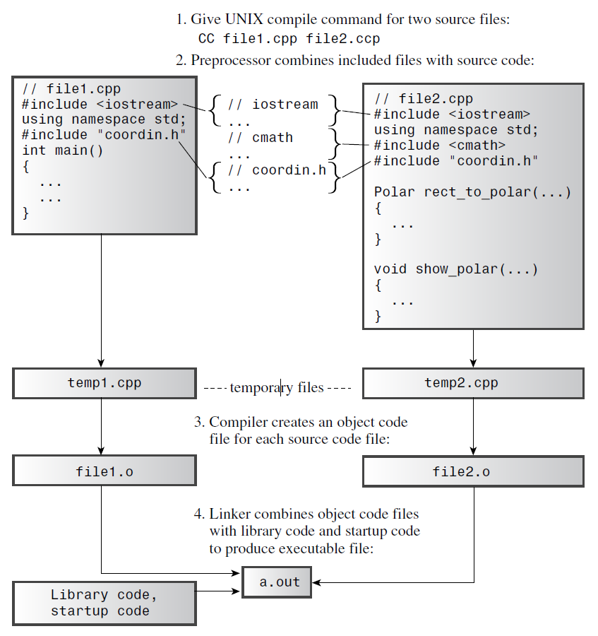
<br>

C++ Standard uses the term `translation unit` instead of `file` in order to preserve greater generality;
the file metaphor is not the only possible way to organize information for a computer. For
simplicity, this book will use the term file, but feel free to translate that to `translation unit`.

<details><summary>
Multiple Library Linking
    </summary>
<figure>

The C++ Standard allows each compiler designer the latitude to implement name decoration
or mangling (see the sidebar “What Is Name Decoration?” in Chapter 8, “Adventures in
Functions”) as it sees fit, so you should be aware that binary modules (object-code files)
created with different compilers will, most likely, not link properly. That is, the two compilers
will generate different decorated names for the same function. This name difference will
prevent the linker from matching the function call generated by one compiler with the function
definition generated by a second compiler. When attempting to link compiled modules,
you should make sure that each object file or library was generated with the same compiler.
If you are provided with the source code, you can usually resolve link errors by recompiling
the source with your compiler.
    </figure>
</details><br>

### Storage Duration, Scope, and Linkage

memory. C++ uses three separate schemes (four under C++11) for storing data, and the schemes differ in how long they preserve
data in memory:

- Automatic storage duration—Variables declared inside a function definition—
including function parameters—have automatic storage duration.They are created
when program execution enters the function or block in which they are defined,
and the memory used for them is freed when execution leaves the function or
block. C++ has two kinds of automatic storage duration variables.
- Static storage duration—Variables defined outside a function definition or else
by using the keyword `static` have static storage duration.They persist for the entire
time a program is running. C++ has three kinds of static storage duration variables.
- Thread storage duration (C++11)—These days multicore processors are common.
These are CPUs that can handle several execution tasks simultaneously.This
allows a program to split computations into separate threads that can be processed
concurrently.Variables declared with the `thread_local` keyword have storage that
persists for as long as the containing thread lasts.This book does not venture into
concurrent programming.
- Dynamic storage duration—Memory allocated by the `new` operator persists
until it is freed with the `delete` operator or until the program ends, whichever
comes first.This memory has dynamic storage duration and sometimes is termed
the free store or the heap.

### Scope and Linkage

`Scope` describes how widely visible a name is in a file (translation unit).
`Linkage` describes how a name can be shared in different units.

A name with external linkage can be shared across files, and a name with internal linkage can be shared by functions
within a single file. Names of automatic variables have no linkage because they are not shared. A C++ variable can
have one of several scopes.A variable that has local scope (also termed block scope) is known only within the block
in which it is defined.

#### Automatic Storage Duration

Function parameters and variables declared inside a function have, by default, automatic storage duration.
They also have local scope and no linkage.That is, if you declare a variable called texas in `main()` and you declare
another variable with the same name in a function called `oil()`, you’ve created two independent variables, each known
only in the function in which it’s defined. Anything you do to the texas in `oil()` has no effect on the texas in main(),
and vice versa.

??? example "autoscp.cpp - illustrating scope of automatic variables"
    <!--codeinclude-->
    [](../programs/autoscp.cpp)
    <!--/codeinclude-->

<details><summary>
Changes to auto in C++11
    </summary>
<figure>

In C++11, the keyword auto is used for automatic type deduction, as you have seen in
Chapters 3, 7, and 8. But in C and in prior versions of C++, `auto` has an entirely different
meaning. It’s used to explicitly identify a variable as having automatic storage:

```cpp
int froob(int n)
{
    auto float ford; // ford has automatic storage
    ...
}
```

Because programmers can use the `auto` keyword only with variables that are already automatic
by default, they rarely bother using it. Its main function is to document that you really
wanted to use a local automatic variable.
In C++11, this usage no longer is valid. The people who prepare standards are reluctant to
introduce new keywords because doing so might invalidate existing code that already uses
that word for other purposes. In this case, it was felt that the old use of `auto` was rare
enough that it was better to repurpose this keyword rather than introduce a new one.
</details><br>

#### Automatic Variables and the Stack

The usual means is to set aside a section of memory and treat it as a stack for managing
the flow and ebb of variables. It’s called a stack because new data is figuratively
stacked atop old data (that is, at an adjacent location, not at the same location) and then
removed from the stack when a program is finished with it.The default size of the stack
depends on the implementation, but a compiler typically provides the option of changing
the size.The program keeps track of the stack by using two pointers. One points to the
base of the stack, where the memory set aside for the stack begins, and one points to the
top of the stack, which is the next free memory location.When a function is called, its
automatic variables are added to the stack, and the pointer to the top points to the next
available free space following the variables

A stack is a LIFO (last-in, first-out) design, meaning the last variables added to the
stack are the first to go.The design simplifies argument passing

#### Register Variables

C originally introduced the `register` keyword to suggest that the compiler use a CPU
register to store an automatic variable:

```cpp
register int count_fast; // request for a register variable
```

The idea was that this would allow faster access to the variable.
Prior to C++11, C++ used the keyword in the same fashion, except that as hardware
and compilers developed in sophistication, the hint was generalized to mean that the variable
was heavily used and perhaps the compiler could provide some sort of special treatment.

With C++11, that hint is being deprecated, leaving `register` as just a way to
explicitly **identify a variable as being automatic**.

#### Static Duration Variables

storage duration variables with three kinds of linkage: external
linkage (accessible across files), internal linkage (accessible to functions within a single
file), and no linkage (accessible to just one function or to one block within a function). All
three last for the duration of the program; they are less ephemeral than automatic variables.
Because the number of static variables doesn’t change as the program runs, the program
doesn’t need a special device such as a stack to manage them. Instead, the compiler
allocates a fixed block of memory to hold all the static variables, and those variables stay
present as long as the program executes. Also if you don’t explicitly initialize a static variable,
the compiler sets it to 0. Static arrays and structures have all the bits of each element
or member set to 0 by default.

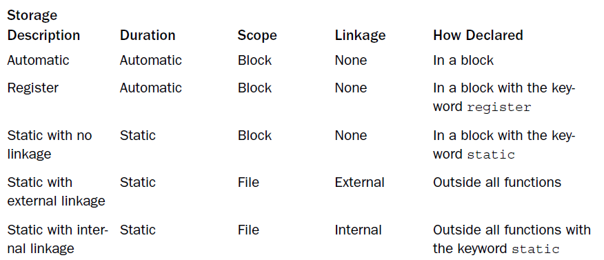
<br>

##### Initializing Static Variables

Static variables may be zero-initialized, they may undergo constant expression initialization,
and they may undergo dynamic initialization.As you may have surmised, zero-initialization
means setting the variable to the value zero

`Zero-initialization` and `constant-expression` initialization collectively are called `static initialization`.
This means the variable is initialized when the compiler processes the file (or
translation unit). Dynamic initialization means the variable is initialized later

```cpp
#include <cmath>
int x; // zero-initialization
int y = 5; // constant-expression initialization
long z = 13 * 13; // constant-expression initialization
const double pi = 4.0 * atan(1.0); // dynamic initialization
```

C++11 introduces a new keyword, `constexpr`, to expand the options for creating constant
expressions; this is one of the new C++11 features that this book does not pursue
further

#### Static Duration, External Linkage

Variables with external linkage are often simply called `external variables`
You can use an external variable in any function that follows
the external variable’s definition in the file.Thus, external variables are also termed global
variables, in contrast to automatic variables, which are local variables.

##### The One Definition Rule

On the one hand, an external variable has to be declared in each file that uses the variable.
On the other hand, C++ has the “one definition rule” (also known as odr), which states
that there can be only one definition of a variable.
To satisfy these requirements, C++ has two kinds of variable declarations. One is the `defining declaration` or, simply,
a `definition`. The second is the referencing declaration or, simply, a declaration. It does not cause storage to be
allocated because it refers to an existing variable.

A referencing declaration uses the keyword extern and does not provide initialization.
Otherwise, a declaration is a definition and causes storage to be allocated:

```cpp
double up; // definition, up is 0
extern int blem; // blem defined elsewhere
extern char gr = 'z'; // definition because initialized
```

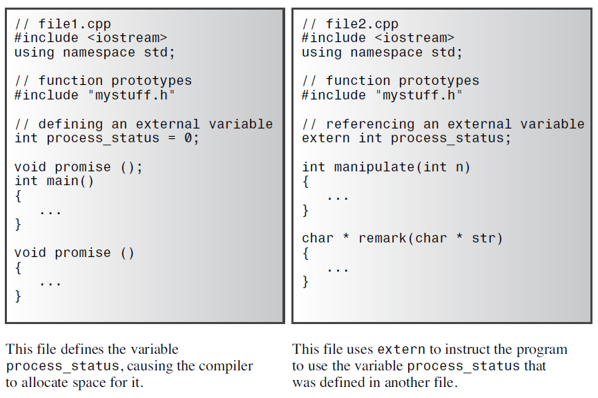
<br>

??? example "_ch9_external.cpp - external variables"
    <!--codeinclude-->
    [](../programs/_ch9_external.cpp)
    <!--/codeinclude-->

??? example "_ch9_support.cpp - use external variable"
    <!--codeinclude-->
    [](../programs/_ch9_support.cpp)
    <!--/codeinclude-->

<details><summary>
Global Versus Local Variables
    </summary>

Now that you have a choice of using global or local variables, which should you use? At first,
global variables have a seductive appeal—because all functions have access to a global
variable, you don’t have to bother passing arguments. But this easy access has a heavy
price: unreliable programs. Computing experience has shown that the better job your program
does of isolating data from unnecessary access, the better job the program does in
preserving the integrity of the data. Most often, you should use local variables and pass
data to functions on a need-to-know basis rather than make data available indiscriminately
by using global variables. As you will see, OOP takes this data isolation a step further.
Global variables do have their uses, however. For example, you might have a block of data
that’s to be used by several functions, such as an array of month names or the atomic
weights of the elements. The external storage class is particularly suited to representing
constant data because you can use the keyword `const` to protect the data from change:

```cpp
const char * const months[12] =
{
    "January", "February", "March", "April", "May",
    "June", "July", "August", "September", "October",
    "November", "December"
};
```

In this example, the first `const` protects the strings from change, and the second `const`
makes sure that each pointer in the array remains pointing to the same string to which it
pointed initially.
</details><br>

#### Static Duration, Internal Linkage

Applying the static modifier to a file-scope variable gives it internal linkage.The difference
between internal linkage and external linkage becomes meaningful in multifile programs.
In that context, a variable with internal linkage is local to the file that contains it.
But a regular external variable has external linkage, meaning that it can be used in different
files, as the previous example showed.

Declaration of a static external variable that has the same name as an ordinary
external variable declared in another file, the static version is the one in scope for that file:

??? example "_ch9_twofile1.cpp - variables with external and internal linkage"
    <!--codeinclude-->
    [](../programs/_ch9_twofile1.cpp)
    <!--/codeinclude-->

??? example "_ch9_twofile2.cpp - variables with internal and external linkage"
    <!--codeinclude-->
    [](../programs/_ch9_twofile2.cpp)
    <!--/codeinclude-->

```cpp
// file1
int errors = 20; // external declaration
...
---------------------------------------------
// file2
static int errors = 5; // known to file2 only
void froobish()
{
cout << errors; // uses errors defined in file2
...
```

This doesn’t violate the one definition rule because the keyword static establishes
that the identifier errors has internal linkage, so no attempt is made to bring in an external
definition.

#### Static Storage Duration, No Linkage

You create such a variable by applying the static modifier
to a variable defined inside a block.When you use it inside a block, static causes a local
variable to have static storage duration.This means that even though the variable is known
within that block, it exists even while the block is inactive.Thus a static local variable can
preserve its value between function calls.

??? example "static.cpp - variables with external and internal linkage"
    <!--codeinclude-->
    [](../programs/static.cpp)
    <!--/codeinclude-->

### Specifiers and Qualifiers

Certain C++ keywords, called `storage class specifiers` and `cv-qualifiers`, provide additional
information about storage. Here’s a list of the storage class specifiers:

```cpp
auto (eliminated as a specifier in C++11)
register
static
extern
thread_local (added by C++11)
mutable
```

A `thread_local` variable is to a thread much as a regular static variable is to the whole program.The keyword `mutable`
is explained in terms of `const`, so let’s look at the cv-qualifiers first before returning to `mutable`.

#### Cv-Qualifiers

```cpp
const
volatile
```

(As you may have guessed, cv stands for `const` and `volatile`.) The most commonly used
cv-qualifier is `const`, and you’ve already seen its purpose: It indicates that memory, after initialized,
should not be altered by a program.

The `volatile` keyword indicates that the value in a memory location can be altered
even though nothing in the program code modifies the contents.

#### `mutable`

```cpp
struct data
{
    char name[30];
    mutable int accesses;
    ...
};
const data veep = {"Claybourne Clodde", 0, ... };
strcpy(veep.name, "Joye Joux"); // not allowed
veep.accesses++; // allowed
```

The `const` qualifier to `veep` prevents a program from changing veep’s members, but
the `mutable` specifier to the `accesses` member shields `accesses` from that restriction.
This book doesn’t use `volatile` or mutable, but there is more to learn about const

#### More About `const`

In C++ (but not C), the const modifier alters the default storage classes slightly.Whereas
a global variable has external linkage by default, a const global variable has internal linkage
by default.That is, C++ treats a global const definition, such as in the following code
fragment, as if the static specifier had been used:

```cpp
const int fingers = 10; // same as static const int fingers = 10;
int main(void)
{

// extern would be required if const had external linkage
extern const int fingers; // can't be initialized
extern const char * warning;

// If, for some reason, you want to make a constant have external linkage, you can use the
// extern keyword to override the default internal linkage:
extern const int states = 50; // definition with external linkage
...
```

<details><summary>
Where C++ Finds Functions
</summary>
<figure>
Suppose you call a function in a particular file in a program. Where does C++ look for the
function definition? If the function prototype in that file indicates that the function is static,
the compiler looks only in that file for the function definition. Otherwise, the compiler (and
the linker, too) looks in all the program files. If it finds two definitions, the compiler sends
you an error message because you can have only one definition for an external function. If it
fails to find any definition in the files, the function then searches the libraries. This implies
that if you define a function that has the same name as a library function, the compiler
uses your version rather than the library version. (However, C++ reserves the names of the
standard library functions, so you shouldn’t reuse them.) Some compiler-linkers need
explicit instructions to identify which libraries to search.
**One definition rule** - use one definition for function.
</figure>
</details><br>

#### Language Linking

suppose you want to use a precompiled function from a C library in a C++ program?
For example, suppose you have this code:

```cpp
spiff(22); // want spiff(int) from a C library
```

Its hypothetical symbolic name in the C library file is `_spiff`, but for our hypothetical
linker, the C++ look-up convention is to look for the symbolic name `_spiff_i`. To get
around this problem, you can use the function prototype to indicate which protocol to use:

```cpp
extern "C" void spiff(int); // use C protocol for name look-up
extern void spoff(int); // use C++ protocol for name look-up
extern "C++" void spaff(int); // use C++ protocol for name look-up```
```

### The Placement `new` Operator

With `new` header file, you can create your own memory-management
procedures or to deal with hardware that is accessed via a particular address or to construct objects in a particular
memory location.

```cpp
#include <new>

struct chaff
{
    char dross[20];
    int slag;
};

char buffer1[50];
char buffer2[500];

int main()
{
    chaff *p1, *p2;
    int *p3, *p4;
    // first, the regular forms of new
    p1 = new chaff; // place structure in heap
    p3 = new int[20]; // place int array in heap
    // now, the two forms of placement new
    p2 = new (buffer1) chaff; // place structure in buffer1
    p4 = new (buffer2) int[20]; // place int array in buffer2
    ...

// ----
// Just as regular new invokes a new function with one argument, the 
// standard placement new invokes a new function with two arguments:
int * pi = new int; // invokes new(sizeof(int))
int * p2 = new(buffer) int; // invokes new(sizeof(int), buffer)
int * p3 = new(buffer) int[40]; // invokes new(40*sizeof(int), buffer)
```

??? example "newplace.cpp - using placement new"
    <!--codeinclude-->
    [](../programs/newplace.cpp)
    <!--/codeinclude-->

### Namespaces

You might want the `List` class from one library and the `Tree` from the other,
and each might expect its own version of Node.
Such conflicts are termed `namespace problems`.

`declarative region` - region in which declarations can be made
`potential scope` - for a variable it begins at its point of declaration and extends to the end of its declarative region.
So the potential scope is more limited than the declarative region because you can’t use a variable above the point
where it is first defined. However, a variable might not be visible everywhere in its potential scope.
`scope` - The portion of the program that can actually see the variable

#### Traditional C++ Namespaces

C++’s rules about global and local variables define a kind of namespace hierarchy. Each
declarative region can declare names that are independent of names declared in other
declarative regions. A local variable declared in one function doesn’t conflict with a local
variable declared in a second function.

#### New Namespace Features

C++ now adds the ability to create named namespaces by defining a new kind of declarative
region, one whose main purpose is to provide an area in which to declare names.

New keyword `namespace` to create two namespaces, `Jack` and `Jill`:

```cpp
namespace Jack {
    double pail;    // variable declaration
    void fetch();   // function prototype
    int pal;        // variable declaration
    struct Well { ... }; // structure declaration
}

namespace Jill {
    double bucket(double n) { ... } // function definition
    double fetch;   // variable declaration
    int pal;        // variable declaration
    struct Hill { ... }; // structure declaration
}
```

The simplest way is to use `::`, the `scope-resolution operator`, to qualify a name with its namespace:

```cpp
Jack::pail = 12.34; // use a variable
Jill::Hill mole;    // create a type Hill structure
Jack::fetch();      // use a function
```

An unadorned name, such as `pail`, is termed the `unqualified name`, whereas a name with
the namespace, as in `Jack::pail`, is termed a `qualified name`.

One thing to keep in mind about using directives and using declarations is that they
increase the possibility of name conflicts

```cpp
using jack::pal;
using jill::pal;
pal = 4; // which one? now have a conflict
```

##### `using` Declarations and `using` Directives

A `using` declaration, then, makes a single name available. In contrast, the `using` directive
makes all the names available

Having to qualify names every time they are used is not always an appealing prospect, so
C++ provides two mechanisms—the `using declaration` and the `using directive` — to simplify
`using` namespace names.

`using` directive in a function treats the
namespace names as being declared outside the function, it doesn’t make those names
available to other functions in the file.

###### `using` Declaration

For example, the using declaration of `Jill::fetch` in `main()` adds fetch to the
declarative region defined by `main()`.

After making this declaration, you can use the name `fetch` instead of `Jill::fetch`.

```cpp
namespace Jill {
    double bucket(double n) { ... }
    double fetch;
    struct Hill { ... };
}
char fetch;
int main()
{
using Jill::fetch;  // put fetch into local namespace
    double fetch;   // Error! Already have a local fetch
    cin >> fetch;   // read a value into Jill::fetch
    cin >> ::fetch; // read a value into global fetch
    ...
}
```

###### `using` Directive

```cpp
using namespace Jack; // make all the names in Jack available
```

##### More Namespace Features

You can nest namespace declarations, like this:

```cpp
namespace elements
{
    namespace fire
    {
        int flame;
        ...
    }
    float water;
}
```

Also you can use using directives and using declarations inside namespaces, like this:

```cpp
namespace myth
{
    using Jill::fetch;
    using namespace elements;
    using std::cout;
    using std::cin;
}
```

Suppose you want to access `Jill::fetch`. Because `Jill::fetch` is now part of the
`myth` namespace, where it can be called `fetch`, you can access it this way:

```cpp
std::cin >> myth::fetch;
std::cout << Jill::fetch; // display value read into myth::fetch
```

`unnamed namespace`:

```cpp
namespace // unnamed namespace
{
    int ice; // internal linkage
    int bandycoot;
}
```

This code behaves as if it were followed by a using directive; that is, the names
declared in this namespace are in potential scope until the end of the declarative region
that contains the unnamed namespace

##### Namespace's Program Example

<details><summary>
Explanation:
</summary>

The first file in this example (see Listing 9.11) is a header file that contains some
items normally found in header files—constants, structure definitions, and function prototypes.
In this case, the items are placed in two namespaces.The first namespace, pers, contains
a definition of a Person structure, plus prototypes for a function that fills a structure
with a person’s name and a function that displays the structure’s contents.The second
namespace, debts, defines a structure for storing the name of a person and the amount of
money owed to that person.This structure uses the Person structure, so the debts namespace
has a using directive to make the names in the pers namespace available in the
debts namespace.The debts namespace also contains some prototypes.

The second file in this example (see Listing 9.12) follows the usual pattern of having a
source code file provide definitions for functions prototyped in a header file.The function
names, which are declared in a namespace, have namespace scope, so the definitions need
to be in the same namespace as the declarations.This is where the open nature of namespaces
comes in handy.The original namespaces are brought in by including namesp.h
(refer to Listing 9.11).The file then adds the function definitions to the two namespaces,
as shown in Listing 9.12.Also the namesp.cpp file illustrates bringing in elements of the
std namespace with the using declaration and the scope-resolution operator.

Finally, the third file of this program (see Listing 9.13) is a source code file that uses
the structures and functions declared and defined in the namespaces. Listing 9.13 shows
several methods of making the namespace identifiers available.

</details><br>

??? example "namesp.h"
    <!--codeinclude-->
    [](../programs/namesp.h)
    <!--/codeinclude-->

??? example "namesp.cpp - namespaces"
    <!--codeinclude-->
    [](../programs/namesp.cpp)
    <!--/codeinclude-->

??? example "usenmsp.cpp - using namespaces"
    <!--codeinclude-->
    [](../programs/usenmsp.cpp)
    <!--/codeinclude-->

##### Namespace's using guidlines

- Use variables in a named namespace instead of using external global variables.
- Use variables in an unnamed namespace instead of using static global variables.
- If you develop a library of functions or classes, place them in a namespace. Indeed,
C++ currently already calls for placing standard library functions in a namespace
called std.This extends to functions brought in from C. For example, the `math.c`
header file, which is C-compatible, doesn’t use namespaces, but the C++ `cmath`
header file should place the various math library functions in `the` std namespace.
- Use the `using` directive only as a temporary means of converting old code to
namespace usage.
- Don’t use `using` directives in header files; for one thing, doing so conceals which
names are being made available.Also the ordering of header files may affect
behavior. If you use a `using` directive, place it after all the preprocessor `#include`
directives.
- Preferentially import names by using the scope-resolution operator or a `using`
declaration.
- Preferentially use local scope instead of global scope for `using` declarations.

Bear in mind that the main motivation for using namespaces is to simplify management
of large programming projects. For simple, one-file programs, using a `using` directive
is no great sin.

---

## Chapter 10: Objects and Classes

<details><summary>
List of what you will learn
</summary>

```sh
 - Procedural and object-oriented programming
 - The concept of classes
 - How to define and implement a class
 - Public and private class access
 - Class data members
 - Class methods (also called class function members)
 - Creating and using class objects
 - Class constructors and destructors
 - const member functions
 - The this pointer
 - Creating arrays of objects
 - Class scope
 - Abstract data types
```

</details><br>

Object-oriented programming (OOP) is a particular conceptual approach to designing
programs, and C++ has enhanced C with features that ease the way to applying that
approach.The following are the most important OOP features:

- Abstraction
- Encapsulation and data hiding
- Polymorphism
- Inheritance
- Reusability of code

### Abstraction and Classes

Abstraction is the crucial step of representing information in terms of its interface with the user. That is, you
abstract the essential operational features of a problem and express a solution in those
terms. In the softball statistics example, the interface describes how the user initializes,
updates, and displays the data. From abstraction, it is a short step to the user-defined type,
which in C++ is a class design that implements the abstract interface

---

Basic data type does three things:

- It determines how much memory is needed for a data object.
- It determines how the bits in memory are interpreted. (A long and a float might
use the same number of bits in memory, but they are translated into numeric values
differently.)
- It determines what operations, or methods, can be performed using the data object.

`class` is a C++ vehicle for translating an abstraction to a user-defined type. It combines
data representation and methods for manipulating that data into one neat package.

`Interface` - shared framework for interactions between two systems—for instance,
between a computer and a printer or between a user and a computer program.

### Access Control

Also new are the keywords private and public. These labels describe access control for
class members.Any program that uses an object of a particular class can access the public
portions directly. A program can access the private members of an object only by using the
public member functions.
This insulation of data from direct access by a pro-
gram is called `data hiding`

### Implementing Class Member Functions

Member function
definitions are much like regular function definitions. Each has a function header and a
function body. Member function definitions can have return types and arguments. But
they also have two special characteristics:

- When you define a member function, you use the scope-resolution operator (::) to
identify the class to which the function belongs.
- Class methods can access the private components of the class.

This notation means you are defining the `update()` function that is a member of the `Stock` class:

```cpp
void Stock::update(double price)
```

Method can access the private members of a class.

Any function with a definition in the class declaration automatically becomes an inline function.

You can define a member function outside the class declaration and still
make it inline.To do so, you just use the inline qualifier

---

-- 001 png

<details><summary>
The Client/Server model
</summary>

OOP programmers often discuss program design in terms of a client/server model. In this
conceptualization, the client is a program that uses the class. The class declaration, includ-
ing the class methods, constitute the server, which is a resource that is available to the pro-
grams that need it. The client uses the server through the publicly defined interface only.
This means that the client’s only responsibility, and, by extension, the client’s programmer’s
only responsibility, is to know that interface. The server’s responsibility, and, by extension,
the server’s designer’s responsibility, is to see that the server reliably and accurately per-
forms according to that interface.

</details>

Change of precision for vars

```cpp
void Stock::show()
{
    using std::cout;
    using std::ios_base;

    // set format to #.###
    ios_base::fmtflags orig =
    cout.setf(ios_base::fixed, ios_base::floatfield);
    std::streamsize prec = cout.precision(3);
    cout << "Company: " << company
    << " Shares: " << shares << ‘\n’;
    cout << " Share Price: $" << share_val;

    // set format to #.##
    cout.precision(2);
    cout << " Total Worth: $" << total_val << ‘\n’;

    // restore original format
    cout.setf(orig, ios_base::floatfield);
    cout.precision(prec);
}
```

### Class Constructors and Destructors

you need to devise an appropriate member function if you’re to suc-
ceed in initializing an object. (You could initialize a class object as just shown if you made
the data members public instead of private, but making the data public goes against one of
the main justifications for using classes: data hiding.)

C++ uses a class constructor whenever you create an object of that class, even when
you use new for dynamic memory allocation. Here’s how to use the constructor with new:

```cpp
Stock *pstock = new Stock("Electroshock Games", 18, 19.0);
```

A `default constructor` is a constructor that is used to create an object when you don’t provide
explicit initialization values.That is, it’s a constructor used for declarations like this:

```cpp
Stock fluffy_the_cat;
// uses the default constructor
```

The `destructor` should clean
up any debris, so it actually serves a useful purpose. For example, if your constructor uses
`new` to allocate memory, the `destructor` should use delete to free that memory.

A destructor must have no arguments. Thus, the prototype for a Stock
destructor must be this:

```cpp
~Stock();
```

Because a Stock destructor has no vital duties, you can code it as a do-nothing function:

```cpp
Stock::~Stock()
{
}
```

<details><summary>
Member Names and Parameter Names
</summary>
Often those new to constructors try to use the class member names as parameter names
in the constructor, as in this example:

```cpp
// NO!
Stock::Stock(const string & company, long shares, double share_val)
{...}
```

This is wrong. The constructor arguments don’t represent the class members; they repre-
sent values that are assigned to the class members. Thus, they must have distinct names,
or you end up with confusing code like this:

```cpp
shares = shares;
```

</details>

??? example "stock10.cpp - Implementation of a Stock class program file"
    <!--codeinclude-->
    [](../programs/stock10.cpp)
    <!--/codeinclude-->

??? example "stock10.h -- Stock class declaration with constructors, destructor added"
    <!--codeinclude-->
    [](../programs/stock10.h)
    <!--/codeinclude-->

??? example "usestock1.cpp - Client file"
    <!--codeinclude-->
    [](../programs/usestock1.cpp)
    <!--/codeinclude-->

<details><summary>
Note
</summary>

You may have noticed that `Client file` has an extra brace at the beginning and near the end
of main(). Automatic variables such as stock1 and stock2 expire when the program exits
the block that contains their definitions. Without the extra braces, that block would be the
body of main(), so the destructors would not be called until after main() completed execu-
tion. In a windowing environment, this would mean that the window would close before the
last two destructor calls, preventing you from seeing the last two messages. But with the
braces, the last two destructor calls occur before the return statement is reached, so the
messages are displayed.
</details>

### C++11 List Initialization

With C++11, can you use the list-initialization syntax with classes? Yes, you can, providing
the brace contents match the argument list of a constructor:

```cpp
Stock hot_tip = {"Derivatives Plus Plus", 100, 45.0};
Stock jock {"Sport Age Storage, Inc"};
Stock temp {};
```

The braced lists in the first two declarations match the following constructor:
Therefore, that constructor will be used to create the two objects.

```cpp
Stock::Stock(const std::string & co, long n = 0, double pr = 0.0);
```

### const Member Functions

Consider the following code snippet:

```cpp
const Stock land = Stock("Kludgehorn Properties");
land.show();
```

With current C++, the compiler should object to the second line.Why? Because the
code for show() fails to guarantee that it won’t modify the invoking object, which,
because it is const, should not be altered.

That is, the show() declaration should look like this:

```cpp
void show() const;          // promises not to change invoking object
```

Similarly, the beginning of the function definition should look like this:

```cpp
void stock::show() const    // promises not to change invoking object
```

Class functions declared and defined this way are called const member functions.

### The `this` Pointer

Suppose, then, that you want to compare the Stock objects stock1 and stock2 and
assign the one with the greater total value to the object top.You can use either of the fol-
lowing statements to do so:

```cpp
top = stock1.topval(stock2);
top = stock2.topval(stock1);
```

Here’s a partial implementation that highlights the problem:

```cpp
const Stock & Stock::topval(const Stock & s) const
{
    if (s.total_val > total_val)
        return s;       // argument object
    else
        return ?????;   // invoking object -> should be *this
}
```

`*this` is as an alias for the invoking object.
The fact that the return type is a reference means that the returned object is the
invoking object itself rather than a copy passed by the return mechanism.

### An Array of Objects

```cpp
Stock mystuff[4]; // creates an array of 4 Stock object
const Stock * tops = mystuff[2].topval(mystuff[1]);
    // compare 3rd and 2nd elements and set tops
    // to point at the one with a higher total value

    // You can use a constructor to initialize the array elements
const int STKS = 4;
Stock stocks[STKS] = {
    Stock("NanoSmart", 12.5, 20),
    Stock("Boffo Objects", 200, 2.0),
    Stock("Monolithic Obelisks", 130, 3.25),
    Stock("Fleep Enterprises", 60, 6.5)
};
```

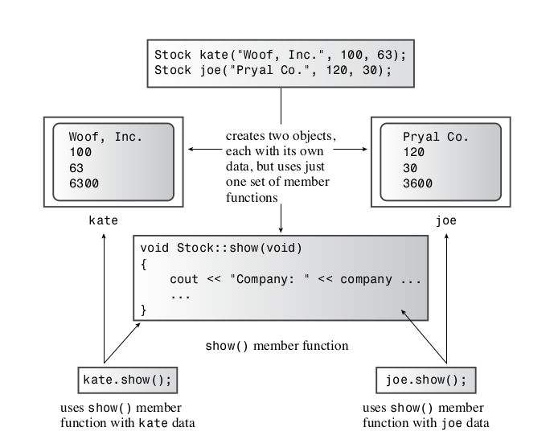

### Abstract Data Types

Using classes is a good way to implement what computer scientists describe as abstract data types (ADTs)
ADT describes a data type in a general fashion without bringing in language or implementa-
tion details.

Stack example: you can store data so that Abstract Data Types
data is always added to or deleted from the top of the stack. For example, C++ programs
use a stack to manage automatic variables.As new automatic variables are generated, they
are added to the top of the stack.When they expire, they are removed from the stack.

Stack is characterized by the operations you can perform on it:

- You can create an empty stack.
- You can add an item to the top of a stack (that is, you can push an item).
- You can remove an item from the top (that is, you can pop an item).
- You can check whether the stack is full.
- You can check whether the stack is empty.

??? example "stack.h - stack data type library"
    <!--codeinclude-->
    [](../programs/stack.h)
    <!--/codeinclude-->

??? example "stack.cpp - implementation of class methods"
    <!--codeinclude-->
    [](../programs/stack.cpp)
    <!--/codeinclude-->

??? example "stacker.cpp - testing stack program - LIFO approach"
    <!--codeinclude-->
    [](../programs/stacker.cpp)
    <!--/codeinclude-->

## Chapter 11: Working with Classes

<details><summary>
List of what you will learn
</summary>

```cpp
In this chapter you’ll learn about the following:
 - Operator overloading
 - Friend functions
 - Overloading the << operator for output
 - State members
 - Using rand() to generate random values
 - Automatic conversions and type casts for classes
 - Class conversion functions
```

</details>

### Operator Overloading

To overload an operator, you use a special function form called an operator function. An
operator function has the following form, where `<sbl>` is the symbol for the operator being
overloaded:

```cpp
operator<sbl>(argument-list)
// For example, operator+() overloads the + operator

// To overload the + operator so that it adds
// sales figures of one salesperson object to another -> if `district2``, `sid`, and `sara` are
// all objects of the `Salesperson` class, you can write this equation:
district2 = sid + sara;

// The compiler, recognizing the operands as belonging to the Salesperson class,
// replaces the operator with the corresponding operator function:
district2 = sid.operator+(sara);
```

??? note
    Don’t return a reference to a local variable or another temporary object. When the function
    terminates and the local variable or temporary object disappears, the reference becomes a
    reference to non-existent data.

Practical example - class for calculating time with `+` operator:

??? example "mytime.h - Prototypes"
    <!--codeinclude-->
    [](../programs/mytime.h)
    <!--/codeinclude-->

??? example "mytime.cpp - Methods"
    <!--codeinclude-->
    [](../programs/mytime.cpp)
    <!--/codeinclude-->

??? example "usetime.cpp - Program"
    <!--codeinclude-->
    [](../programs/usetime.cpp)
    <!--/codeinclude-->

#### Overloading restrictions

- Overloaded operator must have at least one operand that is a user-defined type (Prevents overloading for standard types)
- You can’t use an operator in a manner that violates the syntax rules for the original operator (eg. use `%` with only single operand)
- You can’t create new operator symbols
- You cannot overload the following operators:

|Operator|Description|
|---|---|
| `sizeof` | The sizeof operator |
| `.` | The membership operator |
| `.*` | The pointer-to-member operator|
| `::` | The scope-resolution operator |
| `?:` | The conditional operator |
| `typeid` | An RTTI operator |
| `const_cast` | A type cast operator |
| `dynamic_cast` | A type cast operator |
| `reinterpret_cast` | A type cast operator |
| `static_cast` | A type cast operator |
| `=` | Assignment operator |
| `()` | Function call operator |
| `[]` | Subscripting operator |
| `->` | Class member access by pointer operator |

#### Operators That Can Be Overloaded

|||||||
|---|---|---|---|---|---|
| `+` | `-` | `*` | `/` | `%` | `^` |
| `&` | `\|` | `~` | `!` | `=` | `<` |
| `>` | `+=` | `-=` | `*=` | `/=` | `%=` |
| `^=` | `&=` | `\|=` | `<<` | `>>` | `>>=` |
| `<<=` | `==` | `!=` | `<=` | `>=` | `&&` |
| `\|\|` | `++` | `--` | `,` | `->*` | `->` |
| `()` | `[]` | `new` | `delete` | `new`[] | `delete[]` |

### Friends

Friends come in three varieties:

- Friend functions
- Friend classes
- Friend member functions

Overloading a binary operator (operator with two arguments) for a `class` generates
a need for `friends`. Multiplying a `Time` object by a real number provides just such a situation.

In `Time` class example, overloaded multiplication operator is different
from the other two overloaded operators, it combines two different types -
`addition` and `subtraction` operators each combine two `Time` values, but the `multiplication`
operator combines a `Time` value with a `double` value. This restricts how the operator
can be used. Remember, the left operand is the invoking object.That is,

```cpp
A = B * 2.75;

//Translates to member function call:
A = B.operator*(2.75);
```

```cpp
A = 2.75 * B; // cannot correspond to a member function

// nonmember funtion call from above
A = operator*(2.75, B);

// Would be handled by function with prototype
Time operator*(double m, const Time & t);
```

#### Create Friend

```cpp
// Prototype in class declaration
friend Time operator*(double m, const Time & t); // goes in class declaration

// definition
Time operator*(double m, const Time & t) // friend not used in definition
{
    Time result;
    long totalminutes = t.hours * mult * 60 +t. minutes * mult;
    result.hours = totalminutes / 60;
    result.minutes = totalminutes % 60;
    return result;
}

//...
// It will make statement like below work
A = 2.75 * B; // A = operator*(2.75, B);
```

??? note
    At first glance, it might seem that friends violate the OOP principle of data hiding because
    the friend mechanism allows nonmember functions to access private data. However, that’s
    an overly narrow view. Instead, you should think of friend functions as part of an extended
    interface for a class. For example, from a conceptual point of view, multiplying a `double` by a
    `Time` value is pretty much the same as multiplying a `Time` value by a double. That the first
    requires a friend function whereas the second can be done with a member function is the
    result of C++ syntax, not of a deep conceptual difference. By using both a friend function
    and a class method, you can express either operation with the same user interface. Also
    keep in mind that only a class declaration can decide which functions are friends, so the
    class declaration still controls which functions access private data. In short, class methods
    and friends are simply two different mechanisms for expressing a class interface.

You can write this particular friend function as a non-friend by altering the
definition so that it switches which value comes first in the multiplication

```cpp
Time operator*(double m, const Time & t)
{
    return t * m; // use t.operator*(m)
}
```

#### Overload `<<` Operator

```cpp
cout << trip; // Time member comes first (left to right) like with * overload
```

Definition

```cpp
void operator<<(ostream & os, const Time & t)
{
    os << t.hours << " hours, " << t.minutes << " minutes";
}
```

The function access individual members of the `Time` object but only uses the `ostream` object as a whole.
Because `operator<<()` accesses `private Time` object members directly, it has to be a friend to the `Time` class</br>

But the implementation doesn’t allow you to combine the redefined `<<` operator with
the ones cout normally uses:

```cpp
cout << "Trip time: " << trip << " (Tuesday)\n"; // can't do
// --- 
cout << x << y;     // The compiler reads such code
(cout << x) << y;   // As if it were this
// --- 
```

Thus expression `cout << x` satisfies requirement because `cout` is an `ostream` object.
But the output statement also requires that the whole expression `(cout << x)` be a type
`ostream` object because that expression is to the left of `<< y`.

```cpp
ostream & operator<<(ostream & os, const Time & t)
{
    os << t.hours << " hours, " << t.minutes << " minutes";
    return os;
}
```

this version of `operator<<()` also can be used for file output

```cpp
ofstream fout;
fout.open("savetime.txt");
Time trip(12, 40);
// --- 
fout << trip;           // this statement 
operator<<(fout, trip); // becomes this 
// ---
```

Program mytime changed for class definition as modified to include the two friend functions
`operator*()` and `operator<<()`.

??? example "mytime2.h - Prototypes"
    <!--codeinclude-->
    [](../programs/mytime2.h)
    <!--/codeinclude-->

??? example "mytime2.cpp - Methods"
    <!--codeinclude-->
    [](../programs/mytime2.cpp)
    <!--/codeinclude-->

??? example "usetime2.cpp - Program"
    <!--codeinclude-->
    [](../programs/usetime2.cpp)
    <!--/codeinclude-->

A nonmember version of an overloaded operator function requires as many formal parameters
as the operator has operands. A member version of the same operator requires one
fewer parameter because one operand is passed implicitly as the invoking object.

```cpp
Time operator+(const Time & t) const; // member version
// nonmember version
friend Time operator+(const Time & t1, const Time & t2);
```

### Vector class - abstract data type, overloading and friend functions

<details><summary>
Vectors - phisics and math basics
</summary>

Say you’re a worker bee and have discovered a marvelous nectar cache. You rush back to
the hive and announce that you’ve found nectar 120 yards away. “Not enough information,”
buzz the other bees. “You have to tell us the direction, too!” You answer, “It’s 30 degrees
north of the sun direction.” Knowing both the distance (magnitude) and the direction, the
other bees rush to the sweet site. Bees know vectors.</br></br>

Many quantities involve both a magnitude and a direction. The effect of a push, for example,
depends on both its strength and direction. Moving an object on a computer screen involves
a distance and a direction. You can describe such things by using vectors. For example, you
can describe moving (displacing) an object onscreen with a vector, which you can visualize
as an arrow drawn from the starting position to the final position. The length of the vector is
its magnitude, and that describes how far the point has been displaced. The orientation of
the arrow describes the direction (see figure below). A vector representing such a change in
position is called a displacement vector.

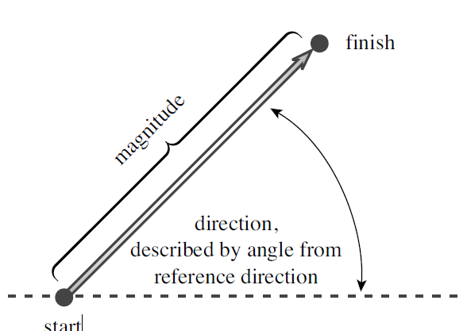
<br>

Now say you’re Lhanappa, the great mammoth hunter. Scouts report a mammoth herd 14.1
kilometers to the northwest. But because of a southeast wind, you don’t want to approach
from the southeast. So you go 10 kilometers west and then 10 kilometers north, approaching
the herd from the south. You know these two displacement vectors bring you to the
same location as the single 14.1-kilometer vector pointing northwest. Lhanappa, the great
mammoth hunter, also knows how to add vectors.

Adding two vectors has a simple geometric interpretation. First, draw one vector. Then draw
the second vector, starting from the arrow end of the first vector. Finally, draw a vector from
the starting point of the first vector to the endpoint of the second vector. This third vector
represents the sum of the first two (see figure below). Note that the length of the sum can
be less than the sum of the individual lengths.

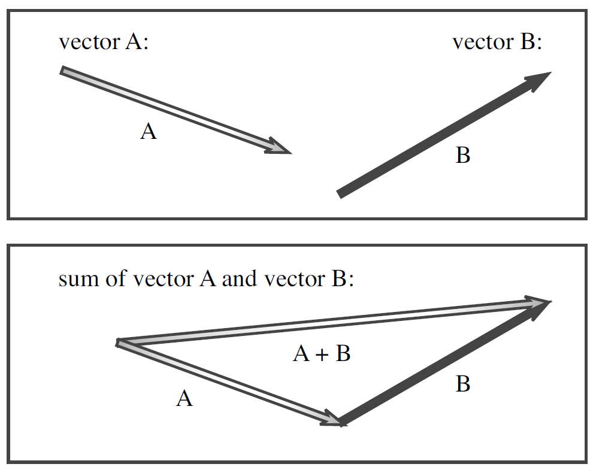
<br>

</details><br>

- You can describe a vector by its `magnitude (length)` and `direction (an angle)`.
- You can represent a vector by its `x` and `y` components.

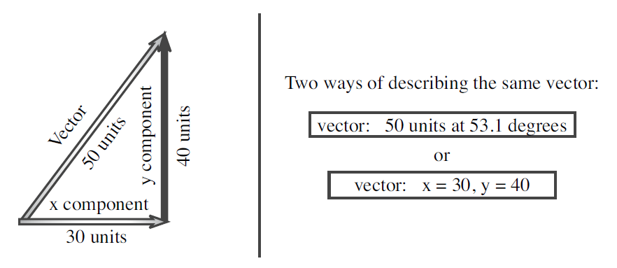
<br>

`Vector Class` on a `Random Walk Algorithm` example

??? example "vect.h - Prototypes"
    <!--codeinclude-->
    [](../programs/vect.h)
    <!--/codeinclude-->

??? example "vect.cpp - Methods"
    <!--codeinclude-->
    [](../programs/vect.cpp)
    <!--/codeinclude-->

??? example "randwalk.cpp - Program"
    <!--codeinclude-->
    [](../programs/randwalk.cpp)
    <!--/codeinclude-->

`State Member` - in the example above the `Vector` class stores both the rectangular coordinates and the polar coordinates for a
vector. It uses a member called mode to control which form the constructor, the `reset()`
method, and the overloaded `operator<<()` function use, with the enumerations `RECT`
representing the rectangular mode (the default) and POL the polar mode
Such a member
is termed a state member because it describes the state an object is in.

### Automatic Conversions and Type Casts for Classes

Conversions for its built-in types - the following statements all generate numeric type conversions

```cpp
long count = 8; // int value 8 converted to type long
double time = 11; // int value 11 converted to type double
int side = 3.33; // double value 3.33 converted to type int 3
```

The C++ language does not automatically convert types that are not compatible (left side is a pointer type, whereas the right side is a number)

```cpp
int * p = 10; // type clash
```

When automatic conversions fail, you may use a type cast:

```cpp
int * p = (int *) 10; // ok, p and (int *) 10 both pointers
```

Example for classes

```cpp
Stonewt myCat; // create a Stonewt object
myCat = 19.6; // not valid if Stonewt(double) is declared as explicit
mycat = Stonewt(19.6); // ok, an explicit conversion
mycat = (Stonewt) 19.6; // ok, old form for explicit typecast
```

Conversions for Stone classes program examples</br>
(Conversion of number to Stone object)

??? example "stonewt.h - Prototypes"
    <!--codeinclude-->
    [](../programs/stonewt.h)
    <!--/codeinclude-->

??? example "stonewt.cpp - Methods"
    <!--codeinclude-->
    [](../programs/stonewt.cpp)
    <!--/codeinclude-->

??? example "stone.cpp - Program"
    <!--codeinclude-->
    [](../programs/stone.cpp)
    <!--/codeinclude-->

### Conversion Functions

(Conversion of Stone object to number)

??? example "stonewt1.h - Prototypes"
    <!--codeinclude-->
    [](../programs/stonewt1.h)
    <!--/codeinclude-->

??? example "stonewt1.cpp - Methods"
    <!--codeinclude-->
    [](../programs/stonewt1.cpp)
    <!--/codeinclude-->

??? example "stone1.cpp - Program"
    <!--codeinclude-->
    [](../programs/stone1.cpp)
    <!--/codeinclude-->

`Conversion functions` are user-defined type casts, and you can use them the way you
would use a type cast. For example, if you define a `Stonewt-to-double` conversion function,
you can use the following conversions:

```cpp
Stonewt wolfe(285.7);
double host = double (wolfe); // syntax #1
double thinker = (double) wolfe; // syntax #2

Stonewt wells(20, 3);
double star = wells; // implicit use of conversion function
```

Note the following points:

- The `conversion function` must be a `class` method.
- The `conversion function` must not specify a `return` type.
- The `conversion function` must have `no arguments`.

You should use implicit conversion functions with care. Often a function that can only be
invoked explicitly is the best choice.

C++ provides the following type conversions for classes:

- A class constructor that has but a single argument serves as an instruction for converting
a value of the argument type to the class type. For example, the `Stonewt` class
constructor with a type int argument is invoked automatically when you assign a
type int value to a `Stonewt` object. However, using explicit in the constructor
declaration eliminates implicit conversions and allows only explicit conversions.
- A special class member operator function called a `conversion function` serves as an
instruction for converting a class object to some other type. The `conversion function`
is a class member, has no declared return type, has no arguments, and is called
operator `typeName()`, where typeName is the type to which the object is to be
converted.This `conversion function` is invoked automatically when you assign a
class object to a variable of that type or use the type cast operator to that type.

Friend functions

```cpp
total = jennySt.operator+(kennyD); // member function
// or else
total = operator+(jennySt, kennyD); // friend function
```

## Chapter 12: Classes and Dynamic Memory Allocation

<details><summary>
List of what you will learn
</summary>

```cpp
- Using dynamic memory allocation for class members
- Implicit and explicit copy constructors
- Implicit and explicit overloaded assignment operators
- What you must do if you use new in a constructor
- Using static class members
- Using placement new with objects
- Using pointers to objects
- Implementing a queue abstract data type (ADT)
```

</details>

### Dynamic Memory and Classes

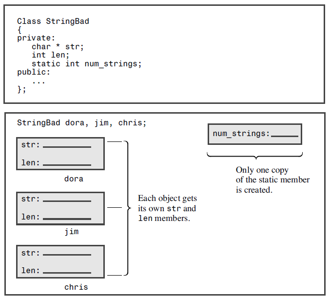

??? example "strngbad.h - Prototypes - flawed string class definition"
    <!--codeinclude-->
    [](../programs/strngbad.h)
    <!--/codeinclude-->

??? example "strngbad.cpp - Methods"
    <!--codeinclude-->
    [](../programs/strngbad.cpp)
    <!--/codeinclude-->

??? example "vegnews.cpp - Program"
    <!--codeinclude-->
    [](../programs/vegnews.cpp)
    <!--/codeinclude-->

The class definition declares and defines two constructors,
but the program uses three constructors.
Consider this line:

```cpp
StringBad sailor = sports;
StringBad sailor = StringBad(sports);   //<- how compiler see it /constructor using sports
StringBad(const StringBad &);           // matching constructor could have this prototype:
//compiler automatically generates this constructor (called a copy constructor),
//which is Special Member Function
```

#### Default *Copy Constructor*

Automatically generated *copy constructor* make `shallow copy` (called `memberwise copying`) of the object - thus the problem.
`memberwise copying` - does not copy the string; it copies the pointer to a string (member-by-member, that is by value - pointer value is address).
You can solve this type of problems in the class design by making a `deep copy`.
Memberwise copying schema is presented on the image below

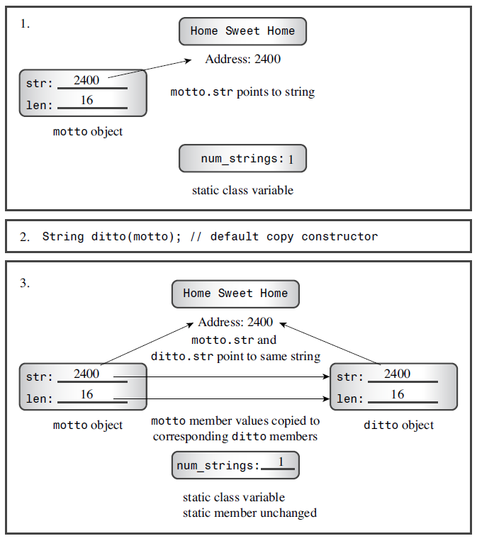

Compiler uses a *copy constructor* whenever a program generates copies of an object
Compiler might generate a temporary `Vector` object to hold an intermediate result when adding three `Vector` objects.

In `vegnews.cpp` program invokes a *copy constructor* `callme2(headline2);`

The program uses a *copy constructor* to initialize `sb`, the formal `StringBad`-type
parameter for the `callme2()` function.

#### Default *Assignment Constructor*

```cpp
Class_name & Class_name::operator=(const Class_name &);
```

That is, it takes and returns a reference to an object of the class. For example, here’s the
prototype for the `StringBad` class:

```cpp
StringBad & StringBad::operator=(const StringBad &);
```

```cpp
StringBad metoo = knot; // use copy constructor, possibly assignment, too
```

Like a *copy constructor*, an implicit implementation of an assignment operator performs
a member-to-member (`memberwise copying`) copy. If a member is itself an object of some class, the program
uses the *assignment operator* defined for that class to do the copying for that
particular member. *Static* data members are unaffected.

Thus again, the address was copied instead of value.

??? danger "Necessary thing to do if `new` is used in class
    If a class contains members that are pointers initialized by new, you should define a copy
    constructor that copies the pointed-to data instead of copying the pointers themselves. This
    is termed deep copying. The alternative form of copying (memberwise, or shallow, copying)
    just copies pointer values. A shallow copy is just that—the shallow “scraping off” of pointer
    information for copying, rather than the deeper “mining” required to copy the constructs
    referred to by the pointers.

### `Special Member Functions`

C++ automatically provides the following member functions:

- `Default constructor` if you define no constructors
- `Default destructor` if you don’t define one
- `Copy constructor` if you don’t define one
- `Assignment operator` if you don’t define one
- `Address operator` if you don’t define one

C++11 provides two more special member functions—the `move constructor` and the
`move assignment operator`

### Solve problem - Defining an Explicit Copy Constructor

Explicit Copy Constructor with a `deep copy` - eg. duplication of the string and
assigning the address of the duplicate to the `str` member.

In short:

- `deep copy` - Copy the member data to the new location
- `membership copy` - Copy the location of the member data

```cpp
StringBad::StringBad(const StringBad & st)
{
    num_strings++;                  // handle static member update
    len = st.len;                   // same length
    str = new char [len + 1];       // allot space
    std::strcpy(str, st.str);       // copy string to new location
    cout << num_strings << ": \"" << str
    << "\" object created\n";       // For Your Information
}
```

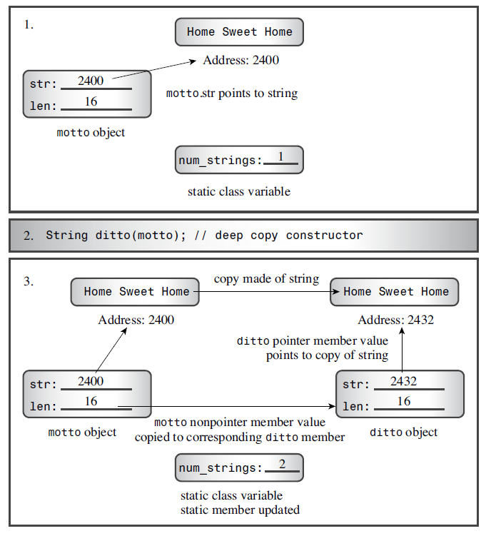

### Solve problem - Overloading an Assignment Operator

```cpp
StringBad & StringBad::operator=(const StringBad & st)
{
    if (this == &st)                // object assigned to itself
        return *this;               // all done

    // If you don’t first apply the delete operator, the previous `string` will remain in memory.
    // Because the program no longer has a pointer to the old string, that memory will be wasted.
    delete [] str;                  // free old string 
    len = st.len;
    str = new char [len + 1];       // get space for new string
    std::strcpy(str, st.str);       // copy the string
    return *this;                   // return reference to invoking object
}
```

Implementation is *similar* to that of the *copy constructor*, but there are some differences:

- Because the target object may already refer to previously allocated data, the function
should use `delete []` to free former obligations.
- The function should protect against assigning an object to itself; otherwise, the freeing
of memory described previously could erase the object’s contents before they
are reassigned.
- The function returns a reference to the invoking object.

??? note "C++11 Null Pointer"
    In C++98, the literal `0` has two meanings—it can be the numeric value `0`, and it can be the
    `null pointer` — thus making it difficult for the reader and compiler to distinguish between the
    two. Sometimes programmers use `(void *) 0` to identify the pointer version. (The null
    pointer itself may have a nonzero internal representation.) Other programmers use `NULL`, a
    C macro defined to represent the null pointer. However, this proved to be an incomplete solution.
    C++11 provides a better solution by introducing a new keyword, nullptr, to denote
    the null pointer. You still can use `0` as before—otherwise an enormous amount of existing
    code would be invalidated—but henceforth the recommendation is to use `nullptr` instead:
    `str = nullptr; // C++11 null pointer notation`

### Improved `String` Class from `StringBad`

With bracket notation and added few operators.

??? example "string1.h - Prototypes"
    <!--codeinclude-->
    [](../programs/string1.h)
    <!--/codeinclude-->

??? example "string1.cpp - Methods"
    <!--codeinclude-->
    [](../programs/string1.cpp)
    <!--/codeinclude-->

??? example "sayings1.cpp - Program"
    <!--codeinclude-->
    [](../programs/sayings1.cpp)
    <!--/codeinclude-->

??? note "Older versions of `get(char *, int)`"
    Older versions of <code>get(char *, int)</code> don’t evaluate to false upon reading an empty line.
    For those versions, however, the first character in the string is a null character if an empty
    line is entered. This example uses the following code:
    <code>
    if (!cin || temp[0] == '\0') // empty line?
    break; // i not incremented
    </code>
    If the implementation follows the current C++ Standard, the first test in the if statement
    detects an empty line, whereas the second test detects the empty line for older implementations

### When Using `new` in Constructors

In particular, you should do the following:

- If you use `new` to initialize a pointer member in a constructor, you should use
`delete` in the destructor.
- The uses of `new` and `delete` should be compatible. You should pair `new` with `delete`
and `new []` with `delete []`.
- If there are multiple constructors, all should use `new` the same way—either all with
brackets or all without brackets. There’s only one destructor, so all constructors have
to be compatible with that destructor. However, it is permissible to initialize a
pointer with `new` in one constructor and with the null pointer (`0`, or, with C++11,
`nullptr`) in another constructor because it’s okay to apply the `delete` operation
(with or without brackets) to the null pointer.

??? note "NULL or 0 or nullptr?"
    Historically, the null pointer can be represented by `0` or by `NULL`, a symbolic constant defined
    as `0` in several header files. C programmers often use `NULL` instead of `0` as a visual
    reminder that the value is a pointer value, just as they use `'\0'` instead of `0` for the null
    character as a visual reminder that this value is a character. The C++ tradition, however, has
    favored a simple `0` instead of the equivalent `NULL`. And, as mentioned earlier, C++11 offers
    the `nullptr` keyword as a better alternative.

- You should define a copy constructor that initializes one object to another by doing
deep copying. Typically, the constructor should emulate the following example:

    ```cpp
    String::String(const String & st)
    {
        num_strings++;                  // handle static member update if necessary
        len = st.len;                   // same length as copied string
        str = new char [len + 1];       // allot space
        std::strcpy(str, st.str);       // copy string to new location
    }
    ```

    In particular, the copy constructor should allocate space to hold the copied data, and
    it should copy the data, not just the address of the data.Also it should update any
    static class members whose value would be affected by the process.

- You should define an assignment operator that copies one object to another by
doing deep copying. Typically, the class method should emulate the following
example:

    ```cpp
    String & String::operator=(const String & st)
    {
        if (this == &st) // object assigned to itself
        return *this; // all done
        delete [] str; // free old string
        len = st.len;
        str = new char [len + 1]; // get space for new string
        std::strcpy(str, st.str); // copy the string
        return *this; // return reference to invoking object
    }
    ```

    In particular, the method should check for self-assignment; it should free memory formerly
    pointed to by the member pointer; it should copy the data, not just the address of
    the data; and it should return a reference to the invoking object.

#### Do's and Don'ts

Constructor:

```cpp
String::String()
{
    str = "default string"; // oops, no new []
    len = std::strlen(str);
}

String::String(const char * s)
{
    len = std::strlen(s);
    str = new char; // oops, no []
    std::strcpy(str, s); // oops, no room
}

String::String(const String & st)
{
    len = st.len;
    str = new char[len + 1]; // good, allocate space
    std::strcpy(str, st.str); // good, copy value
}
```

The result of applying `delete` to a pointer not initialized by `new` is undefined, but it is probably bad
Any of the following would be okay:

```cpp
String::String()
{
    len = 0;
    str = new char[1]; // uses new with []
    str[0] = '\0';
}

String::String()
{
    len = 0;
    str = 0; // or, with C++11, str = nullptr;
}

String::String()
{
    static const char * s = "C++"; // initialized just once
    len = std::strlen(s);
    str = new char[len + 1]; // uses new with []
    std::strcpy(str, s);
}
```

*Destructor* that doesn’t work correctly with the previous *constructors*:

```cpp
String::~String()
{
    delete str; // oops, should be delete [] str;
}
```

### Returning objects

- Reference to a `const` Object - efficient, but with restrictions

??? note "Example"
    If a function *returns* an *object* that is *passed* to it, either by
    *object invocation* or as a *method argument*, you can increase the efficiency of the method
    by having it return a `reference`.

    ```cpp
    // version 1
    Vector Max(const Vector & v1, const Vector & v2)
    {
        if (v1.magval() > v2.magval())
            return v1;
        else
            return v2;
    }

    // version 2
    const Vector & Max(const Vector & v1, const Vector & v2)
    {
        if (v1.magval() > v2.magval())
            return v1;
        else
            return v2;
    }
    ```

- Reference to a Non-`const` Object - eg. overloading assignment operator (*efficiency*) and the `<<` operator (*necessity*)

??? note "Example"

    ```cpp
    // The return value of operator=() is used for chained assignment:
    String s1("Good stuff");
    String s2, s3;
    s3 = s2 = s1
    // The return value of operator<<() is used for chained output:
    String s1("Good stuff");
    cout << s1 << "is coming!";
    ```

- Object return
If its *local* to called *function*, it shouldn't be returned by *reference* (local data is automatically destroyed)
In this case return an `object`

??? note "Example"

    ```cpp
    Vector Vector::operator+(const Vector & b) const
    {
        return Vector(x + b.x, y + b.y);
    }
    ```

- `const` Object return

`Vector::operator+()` allows you to use:

```cpp
net = force1 + force2;                              // 1: three Vector objects
force1 + force2 = net;                              // 2: dyslectic programming
cout << (force1 + force2 = net).magval() << endl;   // 3: demented programming
```

If `Vector::operator+()` is declared to have return type `const Vector`, then Statement 1 is
still allowed but Statements 2 and 3 become invalid.

### `Pointers` to `Objects`

Creating object using keyword `new`

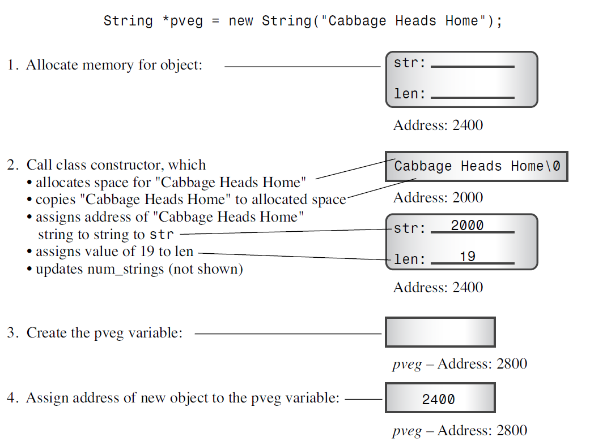

Using pointers with objects

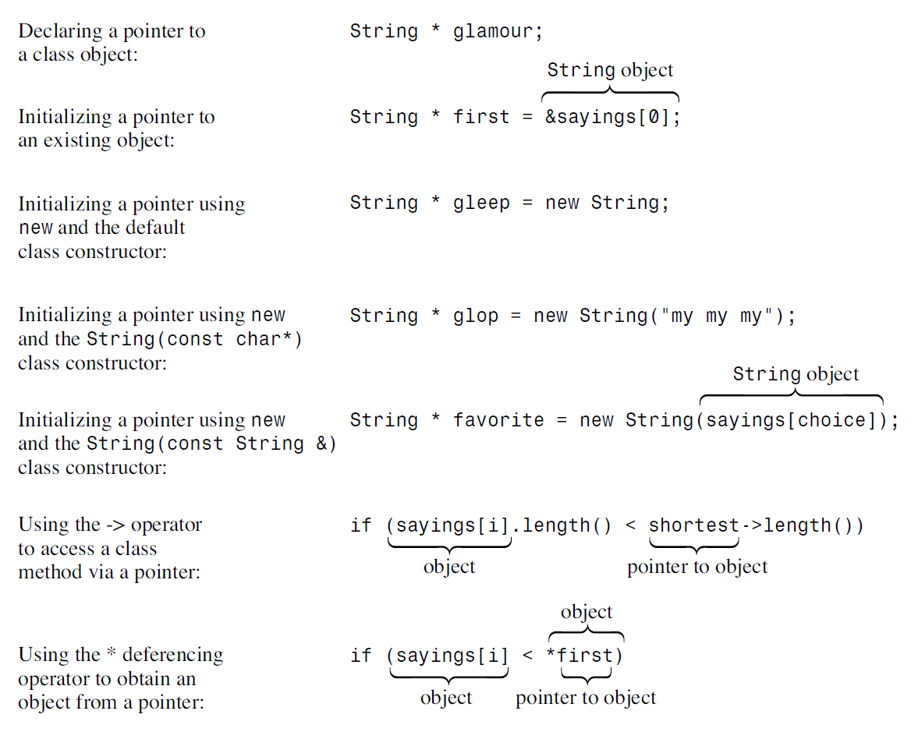

??? example "sayings2.cpp"
    <!--codeinclude-->
    [](../programs/sayings2.cpp)
    <!--/codeinclude-->

??? example "placenew1.cpp"
    <!--codeinclude-->
    [](../programs/placenew1.cpp)
    <!--/codeinclude-->

??? example "placenew2.cpp (fixed placenew1)"
    <!--codeinclude-->
    [](../programs/placenew2.cpp)
    <!--/codeinclude-->

??? note "Object Initialization with `new`"
    In general, if Class_name is a class and if value is of type Type_name, the statement

    ```cpp
        Class_name * pclass = new Class_name(value);
    ```

    invokes this constructor:

    ```cpp
        Class_name(Type_name);
    ```

    There may be trivial conversions, such as to this:

    ```cpp
        Class_name(const Type_name &);
    ```

    Also the usual conversions invoked by prototype matching, such as from int to double,
    takes place as long as there is no ambiguity. An initialization in the following form invokes
    the default constructor:

    ```cpp
        Class_name * ptr = new Class_name;
    ```

### Overload `<<` Operator

Define a friend operator function in form:

```cpp
ostream & operator<<(ostream & os, const c_name & obj)
{
    os << ... ; // display object contents
    return os;
}
```

### Queue Simulation

Problem: Client (Bank) want estimates of how long customers will have to wait in line

A queue is an abstract data type (ADT) and is a FIFO (first in, first out)
structure.

- A queue holds an ordered sequence of items.
- A queue has a limit on the number of items it can hold.
- You should be able to create an empty queue.
- You should be able to check whether a queue is empty.
- You should be able to check whether a queue is full.
- You should be able to add an item to the end of a queue.
- You should be able to remove an item from the front of a queue.
- You should be able to determine the number of items in the queue.

For implementation of queue simulation, `linked list` was used, which consist of `sequence of nodes`,
which is represented by structure:

```cpp
struct Node
{
    Item item; // data stored in the node
    struct Node * next; // pointer to next node
};
```

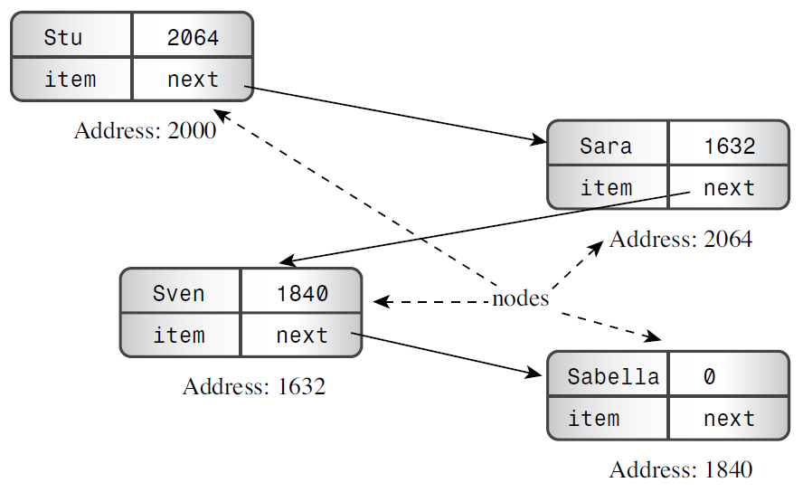

#### `member initializer list`

Problem: `const int qsize` need to be initialized

```cpp
Queue::Queue(int qs)
{
    front = rear = NULL;
    items = 0;
    qsize = qs; // not acceptable!
}
```

Solution:

```cpp
// initializer-list syntax
// 
// Data members are initialized in the order in which they appear in the class declaration,
// not in the order in which initializers are listed.
Queue::Queue(int qs) : qsize(qs) // initialize qsize to qs (via member initializer list)
{
    front = rear = NULL;
    items = 0;
}

Queue::Queue(int qs) : qsize(qs), front(NULL), rear(NULL), items(0) // Also acceptanble
{
}

// C++ 11 Member In-Class Initialization
class Classy
{
    int mem1 = 10; // in-class initialization
    const int mem2 = 20; // in-class initialization
    ...
}
```

Simulation program and class implementation:

??? example "queue.h - Prototypes"
    <!--codeinclude-->
    [](../programs/queue.h)
    <!--/codeinclude-->

??? example "queue.cpp - Methods"
    <!--codeinclude-->
    [](../programs/queue.cpp)
    <!--/codeinclude-->

??? example "bank.cpp - Program"
    <!--codeinclude-->
    [](../programs/bank.cpp)
    <!--/codeinclude-->


<!--    
```sh
./programs/

[str 627] ch 12 - dynamic memory -> [699] Summary
[str 707] ch 13 - class inheritance -> [778] Summary

ch 14 - reusing code in c++ 
ch 15 - friends, exemptions, and more
ch 16 - string class and STL 
ch 17 - input, output and files 
ch 18 - the new c++ standard 
-> [1213]

## Chapter 4

<details><summary>
        List of what you will learn
</summary>

```cpp

```

</details>

### Chapter Review

Notes\C++PrimerPlus\exercises\

<details><summary>
!!!!!Question!!!!!
</summary>
!!!!!Answer!!!!!
</details>

### Programming Exercises

 [1.](../exercises/exercise_ch4_1.cpp) -->
